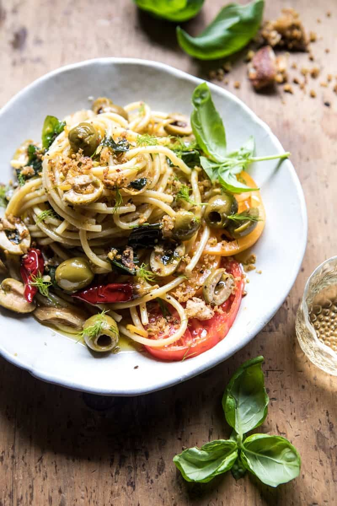

{width=100%}

**Prep Time:** 10 min | **Cook Time:** 20 min | **Total Time:** 30 min

## Ingredients

- 2 cups roughly torn ciabatta bread
- 1/4 cup shelled roasted pistachios
- 1/2 cup olive oil
- 4 cloves garlic, smashed
- 1-3 teaspoons crushed red pepper flakes or 2-3 chili peppers ((use to your taste))
- 2 sprigs fresh oregano
- 2 sprigs fresh thyme
- the rind of one lemon, thinly sliced
- kosher salt and pepper
- 1 cup pitted green olives, halved
- 1 pound bucatini pasta or other long cut pasta
- 1/4 cup white wine
- 1 cup fresh grated parmesan
- 1/4 cup fresh basil, chopped
- 2 tablespoons fresh dill, chopped
- 2  sliced tomatoes or 1 cup cherry tomatoes, for serving

## Instructions

1. Preheat the oven to 375 degrees F.
1. On a baking sheet, combine the bread crumbs, pistachios, 2 tablespoons olive oil, and large pinch of both salt and pepper. Toss well to coat. Transfer to the oven and cook 8-10 minutes or until the breadcrumbs are golden. Remove from the oven.
1. To a large skillet with sides, add the remaining olive oil (about 1/3 cup), the crushed red pepper flakes, garlic, oregano, thyme, lemon rind, and a pinch each of salt and pepper. Set over medium heat and cook, stirring occasionally for 10 minutes or until the garlic is caramelized and fragrant. Reduce the heat to low and then stir in the olives and cook another 5 minutes.
1. Meanwhile, bring a large pot of salted water to a boil. Add the pasta and cook according to package directions until al dente. Just before draining, remove 1 cup of the pasta cooking water. Drain.
1. Add the hot pasta right into the skillet with oil and seasonings. Add the wine and toss to combines. Cook for 5 minutes. Remove from the heat and add the parmesan, basil, and dill, tossing to combine. If needed, thin the pasta with a little of the reserve cooking water.
1. Divide the pasta among each plate. Top with tomatoes, breadcrumbs and fresh basil. EAT.

