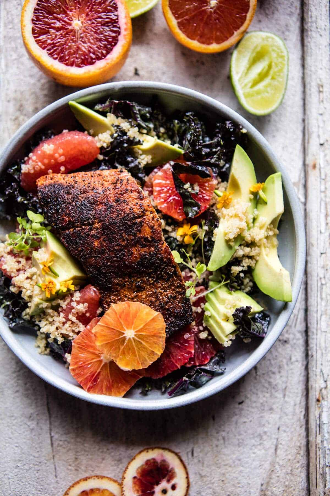

{width=100%}

**Prep Time:** 20 min | **Cook Time:** 10 min | **Total Time:** 30 min

## Ingredients

- 1 pound skin on salmon (cut into 4 pieces)
- 2 tablespoons olive oil
- 1 tablespoon smoked paprika
- 1/2 teaspoon garlic powder
- 1/2 teaspoon dried thyme
- 1/2 teaspoon kosher salt and pepper
- zest of 1 lime
- 1 cup plain greek yogurt
- 1/2 cup fresh cilantro
- juice of 2 limes
- 1 teaspoon honey
- kosher salt
- 1  bunch kale (chopped)
- 3  oranges or grapefruits (I used grapefruit, blood and cara cara oranges)
- 1  avocado (sliced)
- 1 cup cooked quinoa
- fresh cilantro (microgreens, and or basil, for topping)

## Instructions

1. In a large gallon size zip-top bag or bowl, combine the olive oil, smoked paprika, garlic powder, thyme, salt, pepper and lime zest + lime juice. Add the salmon and toss to combine.
1. Heat a medium size skillet over medium-high heat. Add the salmon, skin side facing up. Sear the salmon for 3-4 minutes and then flip and continue cooking for another 4-5 minutes or until the salmon reaches your desired doneness. Cooking times will vary depending on the size of your salmon.
1. To make the salad. In a blender, combine the yogurt, cilantro, lime juice, honey and a large pinch of salt. Blend until creamy and smooth. Taste and add salt if needed.
1. Add the kale to a large bowl and massage with a few tablespoons of the yogurt sauce. Add the oranges, avocado, and quinoa and gently toss to combine. Divide the salad among plates and top with salmon. Serve with the remaining yogurt sauce.

