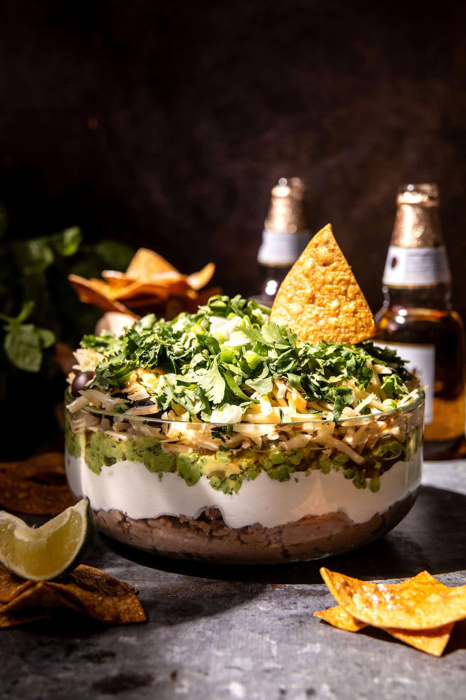

{width=100%}

**Prep Time:** 20 min | **Cook Time:**  | **Total Time:** 20 min

## Ingredients

- 1 1/2 cups refried pinto beans
- 1 1/2 cups sour cream or plain Greek yogurt
- 1 - 2 cups guacamole  ((I always use 2))
- 1/2 cup chunky salsa
- 2 cups mixed, shredded cheddar and pepper jack cheese
- 1 cup pitted black olives
- 1 cup fresh chopped cilantro
- 1/2 cup chopped scallions
- lime juice and sea salt

## Instructions

1. In the bottom of a glass serving bowl or Pyrex dish, layer in the following order: refried beans, sour cream/yogurt, guacamole, salsa, half of the cheese, half the cilantro, half the scallions, and the olives. Top with the remaining cheese.
1. Before serving top the dip with the remaining cilantro, scallions, lime juice, and sea salt. Serve with so many tortilla chips!

