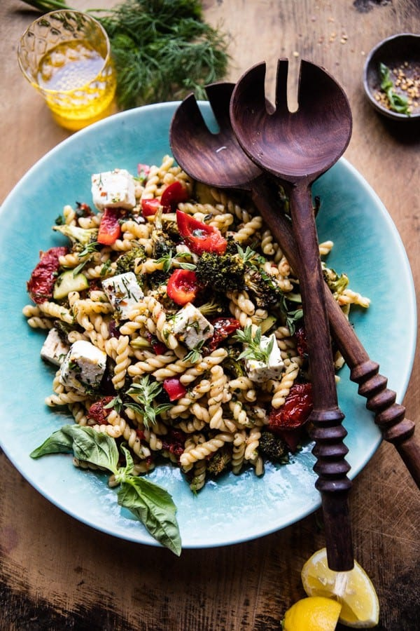

{width=100%}

**Prep Time:** 10 min | **Cook Time:** 20 min | **Total Time:** 30 min

## Ingredients

- 2  heads broccoli, florets roughly chopped
- 1/3 cup pine nuts
- 2 tablespoons olive oil
- 2-4 cloves garlic, minced or grated
- kosher salt and pepper
- 1 pound short cut pasta
- 1 (8 ounce) jar oil packed sun-dried tomatoes
- 1/2 cup pitted kalamata olives
- 1  zucchini thinly, sliced
- 1  red bell pepper, sliced
- 2  Persian cucumbers, chopped
- 1/4 cup fresh oregano, chopped
- 1/4 cup fresh basil, chopped
- 2 tablespoons chopped fresh dill
- juice and zest of 1 lemon
- 8 ounces feta cheese, cubed

## Instructions

1. Preheat the oven to 425 degrees F.
1. On a large baking sheet, toss together the broccoli, pine nuts, 2 tablespoons olive oil, garlic, and a large pinch of both salt and pepper. Transfer to the oven and roast for 20-25 minutes or until the broccoli is just beginning to char.
1. Meanwhile, bring a large pot of salted water to a boil over high heat. Cook the pasta according to package directions until al dente. Drain and add back to the hot pot.
1. While the pasta is still warm, add the roasted broccoli, sun-dried tomatoes - plus the oil in the jar, olives and 3 tablespoons of the olive brine (the liquid surrounding the olives), the zucchini, red pepper, cucumbers, oregano, basil, dill, lemon juice and zest. Toss until well combined and the pasta is coated in oil, if needed drizzle in little olive oil over if there doesn't seem to be enough. Add the feta and gently toss. Serve warm or at room temperature. The pasta can be made up to 1 day in advance.

