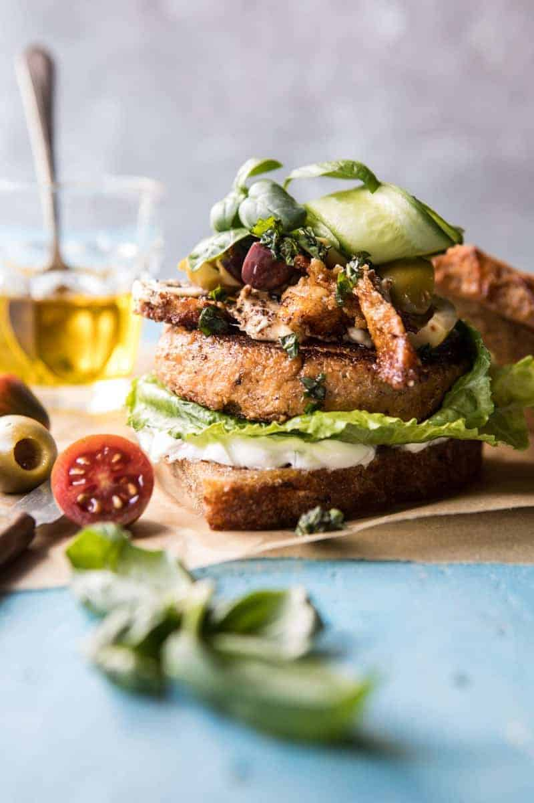

{width=100%}

**Prep Time:** 15 min | **Cook Time:** 30 min | **Total Time:** 45 min

## Ingredients

- 1  medium head cauliflower, cut into florets
- 2 cloves garlic
- 2 tablespoons extra virgin olive oil
- 1 tablespoon chopped fresh oregano
- 1 tablespoon smoked paprika
- kosher salt and pepper
- 1/2 cup raw walnuts
- 1  egg
- 1 cup cooked quinoa
- 6 ounces feta cheese, sliced into 1/4 inch slices
- 6 pieces whole grain bread, toasted
- Tzatziki or yogurt, lettuce, and cucumber, for serving
- 1/2 cup cherry tomatoes halved
- 1/2 cup mixed olives pitted and halved
- 2 tablespoons extra virgin olive oil
- 1/4 cup fresh basil chopped
- pinch of crushed red pepper flakes

## Instructions

1. Preheat the oven to 400 degrees F. Line a baking sheet with parchment.
1. On a baking sheet, toss together the cauliflower, 2 tablespoons olive oil, oregano, paprika, salt and pepper. Transfer to the oven and roast for 15 minutes. Add the walnuts, toss, and return to the oven for another 10-15 minutes. Remove and let cool.
1. Add the cauliflower and walnuts to a food processor with the egg and quinoa. Pulse until combined. Pat the mixture into 6 even patties. The mixture will be sticky. If time allows, place in the fridge to chill, at least one hour or in the freezer for 15 minutes to make them easier to handle.
1. Meanwhile, make the salsa. In a medium bowl, combine the tomatoes, olives, 2 tablespoons olive oil, basil, crushed red pepper flakes, and a pinch of salt.
1. Heat a large skillet over medium-high heat. Add about a drizzle of olive oil. When the oil shimmers, add 2-3 patties at a time and cook until lightly browned, about 5-8 minutes, flip and cook another 5-8 minutes or until firm. Repeat with the remaining patties. Note: these burgers are delicate, be careful when flipping.
1. In the same skillet, add another drizzle of olive oil. Add the feta slices and cook until golden brown, about 2 minutes, flip and cook until browned, about 1 minute.
1. To serve, spread each piece of bread with Tzatziki. Add the burger, fried feta, salsa, and cucumber. Add the top piece of bread. EAT.

