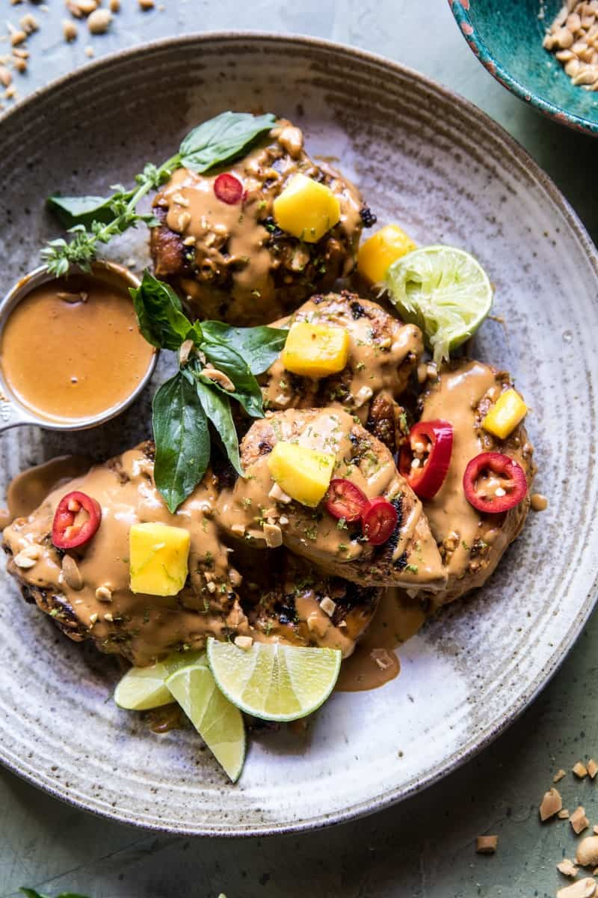

{width=100%}

**Prep Time:** 15 min | **Cook Time:** 15 min | **Total Time:** 1 hr

## Ingredients

- 2 pounds boneless chicken breast or small thighs  ((I used a mix of breast and thighs))
- 1/2 cup canned unsweetened coconut milk
- 1/4 cup low sodium soy sauce
- 1/4 cup honey
- 2 tablespoons Thai red curry paste
- quinoa or rice, for serving
- fresh cilantro or thai basil, for serving
- limes, mango, peanuts and chili peppers for serving
- 1 (14 ounce) can unsweetened coconut milk
- 1/2 cup creamy peanut butter
- 2 tablespoons fish sauce
- 2 tablespoons low sodium soy sauce
- 2 tablespoons Thai red curry paste
- 2 teaspoons tamarind  ((optional))
- juice of lime

## Instructions

1. Whisk together the coconut milk, soy sauce, Thai red curry paste, and honey, in a small bowl. Remove 1/4 cup of the marinade and reserve for cooking. Add the chicken to a large ziplock bag and pour the remaining marinade over the chicken. Let sit for 30 minutes or up to overnight in the fridge.
1. Meanwhile, make the peanut sauce. In a small sauce pan, combine all the ingredients and set over medium low heat, cook stirring often until the sauce is smooth and drizzle-able. Stir in the lime juice. If the sauce seem thick, add water to thin. Keep sauce warm.
1. Preheat an outdoor grill or grill pan to medium heat. Oil the grates.
1. Add the chicken and grill for 5-8 minutes per side, brushing the chicken with the reserved coconut milk mixture until the chicken is cooked through. Remove from the grill and arrange on a serving plate. Drizzle the peanut sauce over the chicken.
1. Serve the chicken over top of a bed of quinoa or rice with fresh mango, limes, and cilantro. Enjoy!

