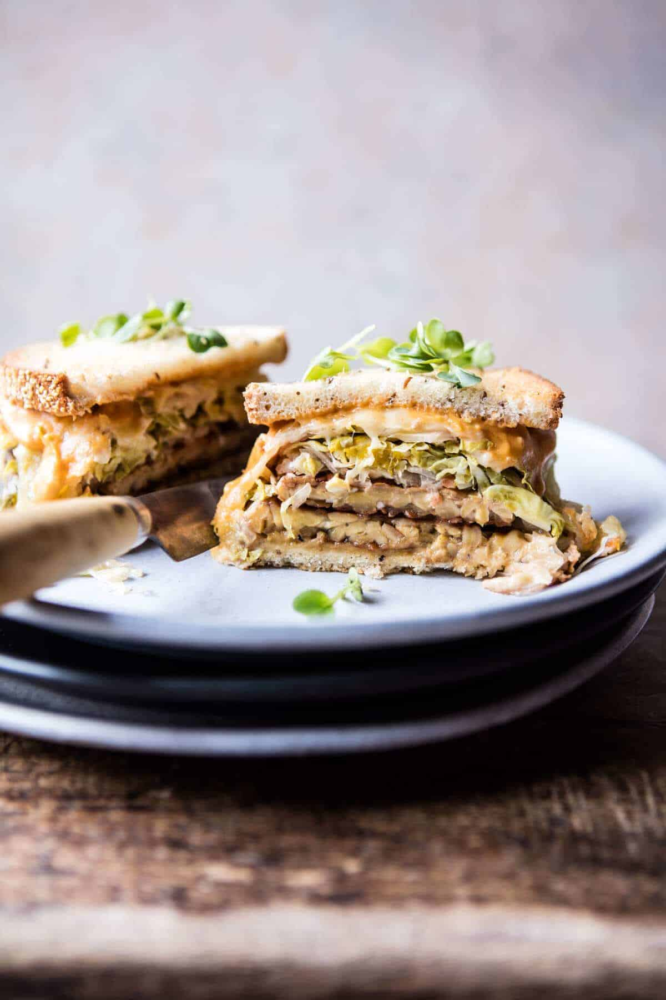

{width=100%}

**Prep Time:** 10 min | **Cook Time:** 15 min | **Total Time:** 25 min

## Ingredients

- 8 ounces brown rice tempeh
- 1/4 cup low sodium soy sauce or tamari
- black pepper
- 1 tablespoon mustard seeds
- 4 slices rye bread
- 2 tablespoons organic butter
- 1/4 cup cashew cheese (optional, recipe follows)
- 1 cup sauerkraut
- 2 slices swiss cheese
- 3/4 cup tahini
- 1-2 tablespoons chili sauce
- juice of 1/2 a lemon
- 1 tablespoon chopped pickle + 1 tablespoon pickle juice
- 1 tablespoon chopped chives
- kosher salt + pepper

## Instructions

1. Slice the tempeh in half lengthwise and then slice each piece in half to create 4 small, thin pieces.
1. In a gallon size zip top bag, combine the tempeh, soy sauce, pinch of black pepper, and mustard seeds. Seal the bag and gently toss to evenly coat. Let marinate for 30 minutes, flipping the bag around half way through.
1. Preheat the oven to 425 degrees F.
1. Heat a large skillet over medium high heat and add the olive oil. When the oil shimmers, add the tempeh in batches and cook until golden crisp, about 3-5 minutes per side. Repeat with the remaining tempeh.
1. Spread the butter over each piece of bread and toast in the oven on a baking sheet for 3-5 minutes. Remove the bread. Spread the bottom pieces of bread with cashew cheese. Add the tempeh, sauerkraut, and swiss cheese. Return the baking sheet to the oven to melt the cheese, about 5 minutes.
1. Meanwhile, make the Healthier 1000 Island Dressing. In a small bowl, whisk together the tahini, chili sauce, lemon juice, chopped pickles and pickle juice. Add water, 1 tablespoon at a time, until the sauce is smooth and pourable. Stir in the chives and season with salt and pepper. Keep stored in the fridge for up to 2 weeks
1. Spread a little dressing on the inside of the remaining 2 pieces of bread. Remove the sandwiches from the oven and add the top piece of bread, dressing side facing down. Slice each sandwich in half. EAT.

