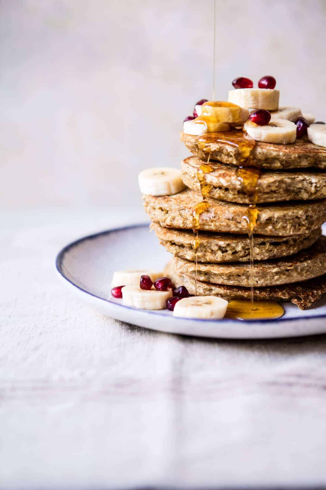

{width=100%}

**Prep Time:** 10 min | **Cook Time:** 10 min | **Total Time:** 20 min

## Ingredients

- 2  whole eggs + 2 egg whites
- 1  medium/large ripe banana
- 1 cup old fashioned oats
- 2 teaspoons vanilla extract
- 1 teaspoon baking powder
- 1/2 teaspoon cinnamon
- 1/2 teaspoon ginger
- 1/4 teaspoon cardamon
- 1/4 teaspoon all-spice
- 1/4 teaspoon salt
- maple syrup (bananas, and fresh fruit, for serving)

## Instructions

1. In a blender, combine the eggs, egg whites, banana, oats, vanilla, baking powder, cinnamon, ginger, cardamon, all-spice, and salt. Blend until the oatmeal is finely ground and the mixture looks like pancake batter, about 30 seconds to 1 minute. It's OK if there are small chunks.
1. Heat a large skillet or griddle over medium heat and lightly grease the skillet with oil. Pour about 1/4 cup batter onto the center of the hot pan and gently spread the batter to form a circle. Cook until bubbles appear on the surface. Using a spatula, gently flip the pancake over and cook the other side for a minute, or until golden. Repeat with the remaining batter. Serve the pancakes with bananas, fresh fruit, and maple. Eat!

