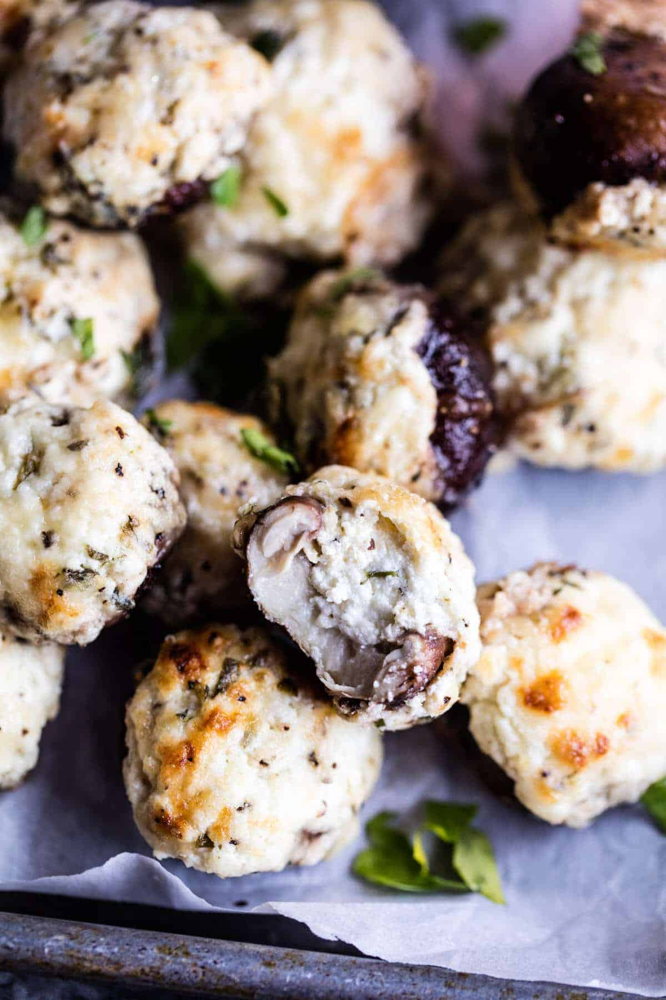

{width=100%}

**Prep Time:** 10 min | **Cook Time:** 20 min | **Total Time:** 30 min

## Ingredients

- 1 (8 ounce) log goat cheese
- 1 cup shredded fontina cheese
- 1/2 cup grated parmesan cheese
- 1 tablespoon chopped fresh thyme
- 1 tablespoon chopped fresh sage
- 1 tablespoon chopped chives
- kosher salt and pepper
- 16 ounces cremini mushrooms (stems removed)

## Instructions

1. Preheat the oven to 375 degrees F.
1. In a medium bowl, mix together the goat cheese, 1/2 cup fontina cheese, parmesan cheese, thyme, sage, chives, and a good pinch of both salt and pepper.
1. Remove the stems from the mushrooms and spoon the mixture into each mushroom cap, place on a baking sheet. Top with the remaining 1/2 cup fontina cheese. Transfer to the oven and bake for 20 to 25 minutes or until hot and bubbly. Serve warm!

