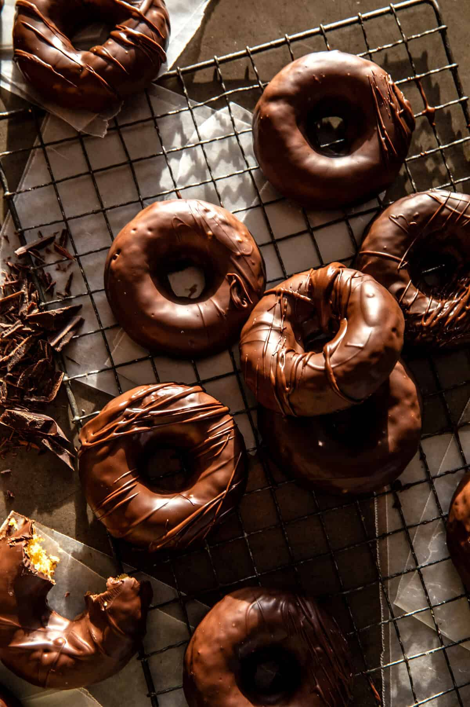

{width=100%}

**Prep Time:** 20 min | **Cook Time:** 10 min | **Total Time:** 30 min

## Ingredients

- 4 tablespoons salted butter
- 1/3 cup maple syrup or honey
- 1/2 cup plain Greek yogurt
- 2 teaspoons vanilla extract
- 2  eggs, at room temperature
- 2 cups all purpose flour
- 1 1/2 teaspoons baking powder
- 1 teaspoon baking soda
- 1/2 teaspoon salt
- 1 cup mini chocolate chips
- 2 tablespoons avocado oil

## Instructions

1. Preheat the oven to 350° F. Grease a 6-cup doughnut pan or 12-cup muffin pan with melted butter.
1. Add 4 tablespoons butter to a pot set over medium heat. Allow the butter to brown lightly until it smells toasted, 2-3 minutes. Remove from the heat.
1. In a large mixing bowl, whisk together the brown butter, maple syrup, yogurt, eggs, and vanilla until combined. Add the flour, baking powder, baking soda, and salt, and mix until just combined.
1. Divide the batter evenly among the prepared pan, filling 1/2-2/3 of the way full. Bake 10-12 minutes, until just set. Remove and let cool 5 minutes, then run a knife around the edges to release and invert the pan.
1. Meanwhile, make the glaze/frosting. Microwave the chocolate chips and oil on 30-second intervals, stirring after each, until melted and smooth.
1. Dip or drizzle the doughnuts into the glaze. Let the chocolate set or quickly chill in the freezer until set.

