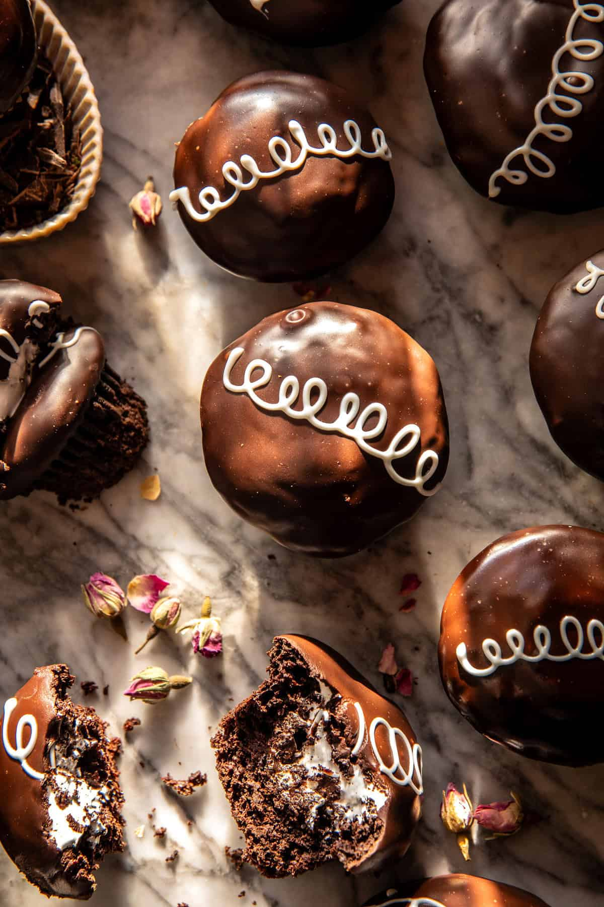

{width=100%}

**Prep Time:** 1 hr | **Cook Time:** 30 min | **Total Time:** 1 hr 30 min

## Ingredients

- 1/2 cup melted coconut oil
- 2  large eggs, at room temperature
- 1/2 cup buttermilk, at room temperature
- 1/2 cup plain Greek yogurt or sour cream
- 1 cup granulated sugar
- 1 tablespoon vanilla extract
- 1 1/2 cups all-purpose flour
- 1 cup unsweetened cocoa powder
- 1 1/2 teaspoons baking powder
- 1 teaspoon baking soda
- 1 teaspoon salt
- 1/2 cup hot black coffee
- 3  egg whites
- 3/4 cup granulated sugar
- 1/2 teaspoon cream of tartar
- 1 teaspoon pure vanilla extract
- 1 cup semi-sweet chocolate chips
- 1/3 cup milk
- 1 cup white chocolate chips, melted

## Instructions

1. To make the cupcakes. Preheat oven to 350° F. Line cupcake molds with paper liners.
1. In a large bowl, beat together the oil, eggs, milk, yogurt, sugar, and vanilla. Add the flour, cocoa powder, baking powder, baking soda, and salt. Mix until combined, then slowly beat in the hot coffee until combined.
1. Divide the batter evenly among the prepared cupcake molds. Bake for 25-30 minutes until the tops are just set. Remove and let cool.
1. Meanwhile, make the marshmallow. Place egg whites, sugar, and cream of tartar in a heatproof bowl. Set the bowl over a pot filled with 2 inches of simmering water. Do not let it touch the water (use a double broiler if you have one). Whisk constantly until the sugar is dissolved and the mix is opaque, about 5 minutes. Remove from heat. Add the vanilla, and then use an electric mixer set on high to beat until stiff glossy peaks form, about 5 minutes.
1. Using a paring knife, cut a cone-shaped piece from the center of each cupcake. Fill the hole with marshmallow fluff.
1. To make the glaze. Melt the chocolate and milk together over low heat, stirring often until smooth. Dip the top of each cupcake into the chocolate, allowing any excess to drip off. Let the glaze set.
1. Spoon the melted white chocolate into a piping bag fit with a small round tip. You can also use a sandwich bag and cut the tip of one of the corners off. Draw loops on the top of each cupcake. Enjoy!

