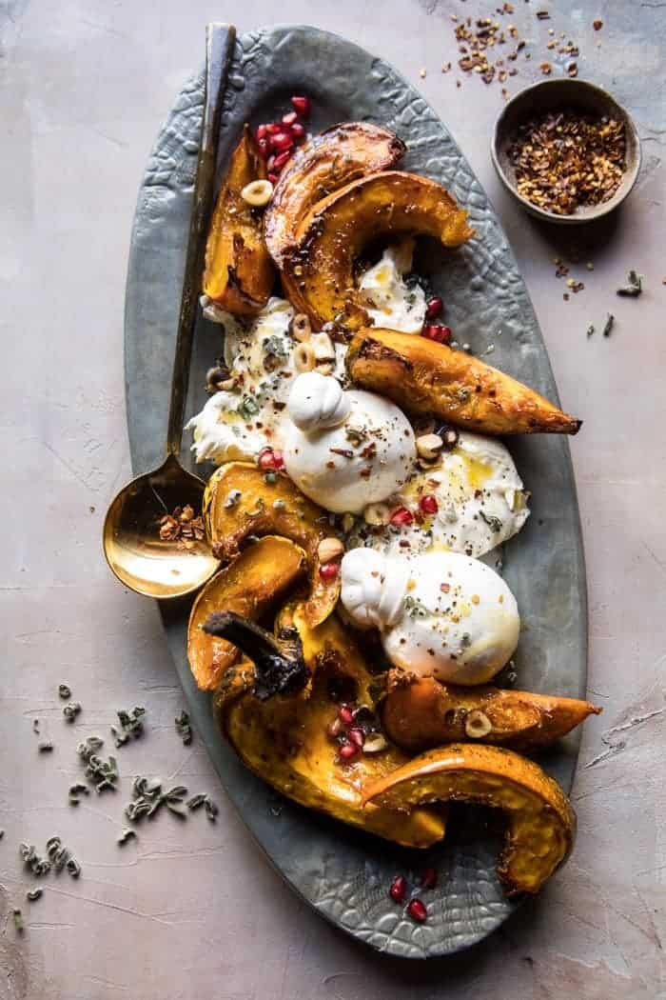

{width=100%}

**Prep Time:** 10 min | **Cook Time:** 30 min | **Total Time:** 40 min

## Ingredients

- 2  acorn squash, seeded and cut into wedges
- 4 tablespoons butter
- 2 tablespoons honey, plus more for drizzling
- 1 tablespoon brown sugar
- 1/2-1 teaspoon crushed red pepper flakes, to taste
- kosher salt and pepper
- 2-3 balls burrata cheese
- extra virgin olive oil, for drizzling
- 4  fresh sage leaves, chopped
- 1/2 cup roasted, salted hazelnuts, roughly chopped
- 1/2 cup pomegranate arils

## Instructions

1. Preheat the oven to 425 degrees F.
1. On a baking sheet, toss together the squash, butter, honey, brown sugar, crushed red pepper flakes, and a pinch each of kosher salt and pepper, tossing to coat. Transfer to the oven and roast for 30-40 minutes, until the squash is golden and tender, turning halfway through cooking.
1. Arrange the squash on a serving platter and break the balls of burrata over the top. Drizzle with olive oil and season the burrata with salt and pepper. Sprinkle the sage, hazelnuts, and pomegranate over top. If desired, drizzle with a little honey. Serve!

