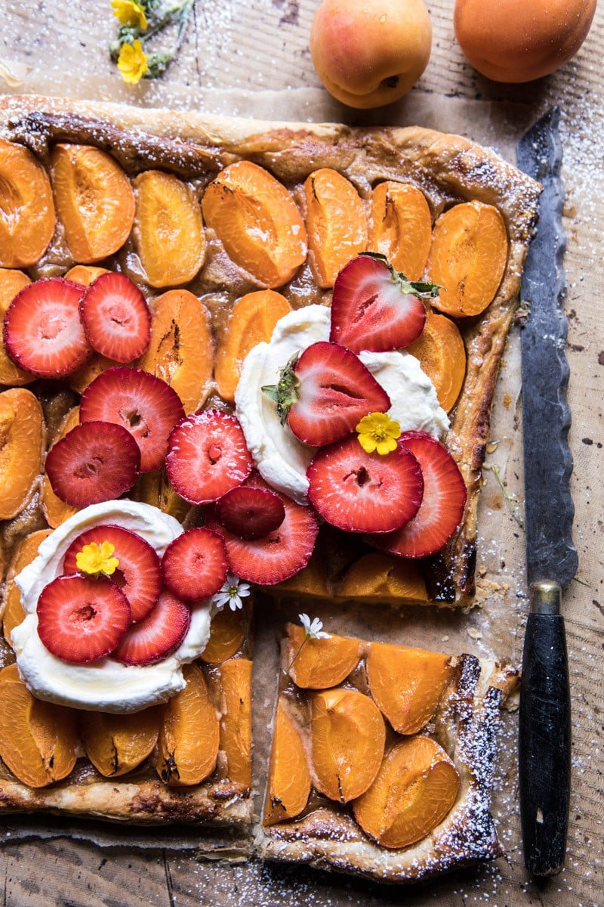

{width=100%}

**Prep Time:** 15 min | **Cook Time:** 30 min | **Total Time:** 45 min

## Ingredients

- 1/2 cup almonds, toasted
- 1/4 cup honey + more for drizzling
- 4 tablespoons butter, at room temperature + melted butter for crust
- 1  egg
- 1 teaspoon vanilla extract
- 1 sheet frozen puff pasty, thawed
- 12  apricots, quartered
- 4 ounces mascarpone cheese
- 1/2 cup heavy whipping cream
- 1 cup fresh strawberries, sliced
- basil and powdered sugar, for serving

## Instructions

1. Preheat the oven to 375 degrees F.
1. Pulse the almonds in a food processor until very finely ground. Add the honey, butter, egg, and vanilla and pulse until smooth.
1. On a lightly floured surface, roll the puff pastry out into a rectangle about 1/4 inch thick. Place the pastry on a parchment lined baking sheet and spread the almond cream over the pastry, leaving a 1/4 inch border. Arrange the apricots over the cream and then drizzle with honey. Brush the edges of the pastry with melted butter. Transfer to the oven and bake for 25-30 minutes or until golden brown. It is OK if the edges get dark.
1. Meanwhile, whip the mascarpone and cream together until stiff peaks form.
1. Allow the tart to cool slightly and then serve dolloped with whipped cream and topped with fresh strawberries and a dusting of powdered sugar, if desired.

