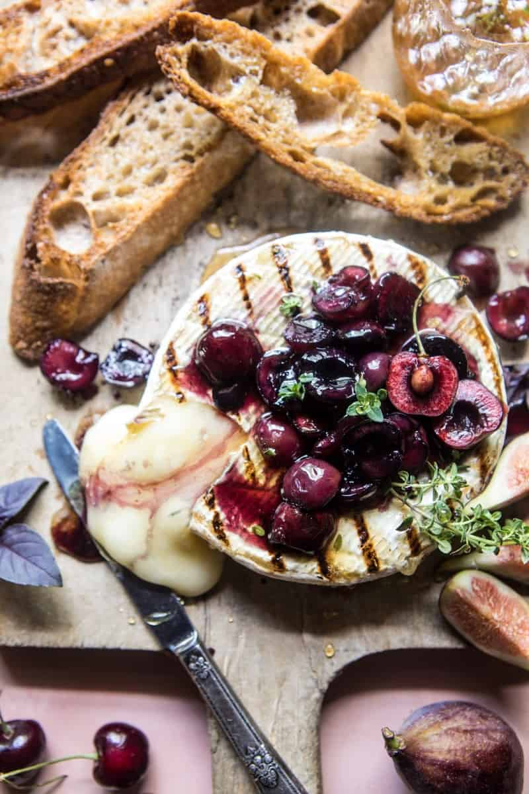

{width=100%}

**Prep Time:** 10 min | **Cook Time:** 15 min | **Total Time:** 25 min

## Ingredients

- 1/3 cup honey
- 4  sprigs fresh thyme
- pinch of flakey sea salt
- 1  (8 ounce) brie wheel
- 1 tablespoon butter or olive oil, plus more for rubbing
- 1 cup pitted cherries
- 1-2 tablespoons bourbon ((optional))
- toasted or grilled bread, for serving

## Instructions

1. Add the honey, thyme, and salt to a small saucepan and simmer over medium heat until it begins to boil. Remove from the heat let the honey sit 5 minutes or until ready to serve. You can make the honey up to a week in advance.
1. Preheat your grill or grill pan to high heat. Rub the brie with a little olive oil and sprinkle with salt. Place on the grill and grill for about 2-3 minutes per side or until the brie feels warm and gooey inside. Be careful when flipping the brie, you do not want to break the brie open. Carefully remove from the grill.
1. Meanwhile, add the butter, cherries, and bourbon (if using), to a small skillet set over medium high heat. Cook stirring occasionally until the cherries begin to release their juices, about 5 minutes. Remove from the heat.
1. To serve, place the warm brie on a serving plate. Top with cherries and drizzle generously with honey. Enjoy with toasted bread or crackers!

