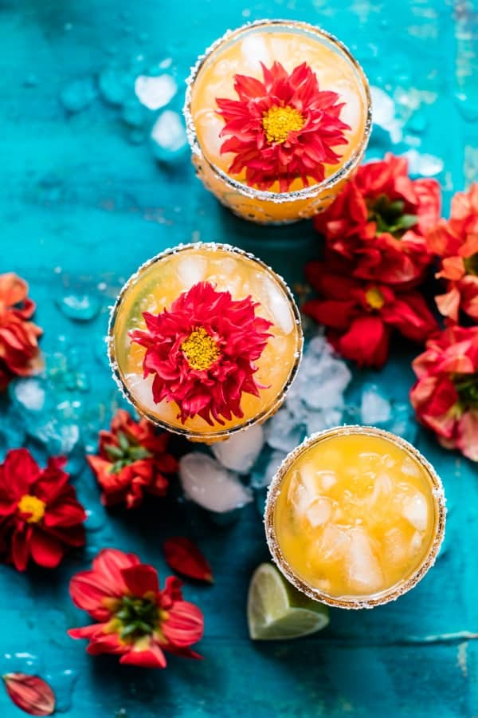

{width=100%}

**Prep Time:** 5 min | **Cook Time:**  | **Total Time:** 5 min

## Ingredients

- salt, for the rim
- 1/4 cup mango juice
- juice of 1/2 a lemon
- juice of 1/2 a lime
- 1 1/2 ounces Mezcal
- 1 1/2 ounces silver tequila
- pinch of chili powder, to taste
- sparkling water for topping

## Instructions

1. Run a lime wedge around the rim of your glass and coat in salt.
1. Combine the mango juice, lemon juice, lime juice, Mezcal, tequila, and chili powder in a cocktail shaker and fill with ice. Shake until combined and then strain into your prepared glass. Top with sparkling water. Serve with limes. Drink!

