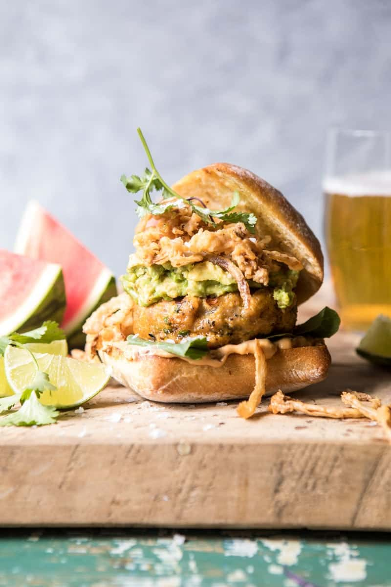

{width=100%}

**Prep Time:** 25 min | **Cook Time:** 25 min | **Total Time:** 50 min

## Ingredients

- 2  jalapeños
- 1 pound ground turkey or chicken
- 1/2 cup grated cheddar cheese
- 1/3 cup panko bread crumbs
- 1  egg
- 1 teaspoon smoked paprika
- kosher salt and pepper
- 4 slices smoked gouda or cheddar
- 4  burger buns, toasted
- 2  avocados lightly mashed
- juice from 1 lime
- chipotle mayo and fresh cilantro, for serving
- 2 large white onions, halved and then sliced very thin
- 2 cups buttermilk
- 2 cups flour
- Kosher salt and pepper
- oil, for frying

## Instructions

1. Preheat the broiler to high. Place the jalapeños on a baking sheet and place under the broiler. Broil until charred all over, about 5 minutes. Remove and let cool and then seed and chop the jalapeños.
1. In a medium bowl, combine the jalapeños, turkey, cheddar, panko, egg, paprika, salt, and pepper. Mix until just combined and then shape the mix into 4 even size burger patties.
1. Preheat the outdoor grill or grill pan to high. Grill the burger for 5 minute per side or until cooked through. During the last minute of cooking add the cheese slices.
1. To assemble, spread the chipotle mayo on the bottom of each bun. Top with a burger, avocado, lime juice and a pinch of salt. Add the crispy onions (recipe follows) and cilantro. EAT

