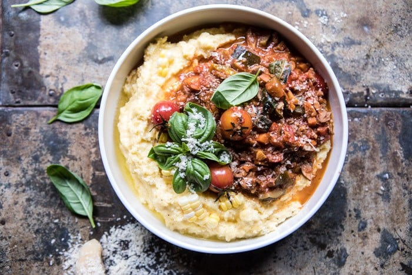

{width=100%}

**Prep Time:** 15 min | **Cook Time:** 30 min | **Total Time:** 45 min

## Ingredients

- 4 tablespoons extra virgin olive oil
- 1  small sweet onion, diced
- 2  carrots, chopped
- 1  zucchini, chopped
- 1  bell pepper, chopped
- 2 cups cremini mushrooms, chopped
- 4 cloves garlic, minced or grated
- 2 tablespoons chopped fresh thyme
- kosher salt and pepper
- 1 (28 ounce) can san marzano tomatoes
- 1 cup cherry tomatoes
- 1 cup white wine
- 1/2 cup raw walnuts, chopped
- 1 handful fresh basil
- 2 cups whole milk
- 1 cup instant polenta
- 2   ears corn, kernels removed
- 2 tablespoons butter
- kosher salt and pepper

## Instructions

1. Heat the olive oil in a large skillet set over medium heat.
1. When the oil shimmers, add the onions and carrots and cook until softened, about 5 minutes. Stir in the zucchini, bell peppers, mushrooms, garlic, and thyme. Season with salt and pepper. Cook for 8-10 minutes or until the veggies are tender.
1. Stir in all of the tomatoes, wine, and 1/2 cup water. Stir in the walnuts. Shimmer the sauce for 20 minutes or until it has thickened and the tomatoes have burst. Season with salt and pepper and then stir in the basil.
1. Meanwhile, make the polenta. In a medium saucepan bring 2 cups of water and the milk to a boil over medium heat. Slowly whisk in the polenta, stirring, until the polenta is soft and thick, about 5 minutes. Stir in the corn and butter until melted. Season with salt and pepper.
1. Ladle the bolognese over the polenta. Enjoy!

