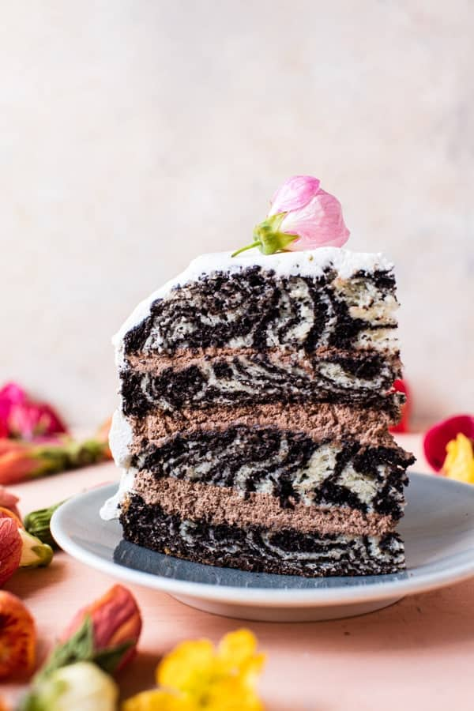

{width=100%}

**Prep Time:** 25 min | **Cook Time:** 35 min | **Total Time:** 1 hr

## Ingredients

- 4 cups all-purpose flour
- 1 tablespoon baking powder
- 2 teaspoons kosher salt
- 2 cups buttermilk
- 1/4 cup plain greek yogurt
- 1 cup canola oil
- 4  eggs
- 2 cups granulated sugar
- 1 tablespoon vanilla extract
- 1/2 cup unsweetened cocoa powder
- 1/4 cup black coffee
- 4 cups heavy whipping cream
- 1/2 cup unsweetened cocoa powder
- 1/3-1/2 cup honey or powdered sugar
- 2 teaspoons vanilla extract
- pinch of sea salt

## Instructions

1. Preheat the oven to 350 degrees F. Grease 2 (8 inch) round cake pans.
1. In a large bowl, mix together the flour, baking powder, and salt.
1. In the bowl of a stand mixer (or use a hand held mixer) beat together the buttermilk, greek yogurt, canola oil, eggs, sugar, and vanilla until smooth. Slowly add the dry ingredients to the wet ingredients with the mixer on low until there are no longer any clumps of flour. Batter should be pourable, but not super thin.
1. Divide the batter in half. Set one batter aside. To the other batter, add the cocoa powder and coffee, beating until smooth.
1. Spoon about 1/4 cup of vanilla batter (the one set aside) into the center of each prepared 8 inch pan. Now spoon 1/4 cup chocolate batter directly over the vanilla batter. Repeat this process, always spooning the batter into the center of the pan. It helps to tap the pans against the center every so often to evenly distribute the batter. Don't stress if things looks a little uneven.
1. Transfer to the oven and bake for 35-40 minutes or until a toothpick inserted into the center comes out clean. Let cool 5 minutes and then invert the cakes onto a wire rack to cool completely.
1. Meanwhile, make the mousse. Add 3 cups heavy cream to the bowl of a stand mixer fitted with the whisk attachment or use a hand held mixer. Whisk the cream until stiff peaks form. Add the cacao powder, honey, and vanilla and stir until combined and creamy. Cover and place in the fridge.
1. To assemble. Using a serrated knife, slice the cakes in half horizontally. Place one cake layer on a cake stand and spread with mousse. Add another layer and then more mousse. Continue with the remaining 2 layers and mousse.
1. Add the remaining 1 cup heavy cream to the bowl of a stand mixer fitted with the whisk attachment or use a hand held mixer. Whisk the cream until stiff peaks form. Stir in 2 tablespoons honey. Spread the whipped cream around the outside of the cake. decorate as desired. Cake can be made up to 1 day in advance. Keep stored in the fridge until ready to serve.

