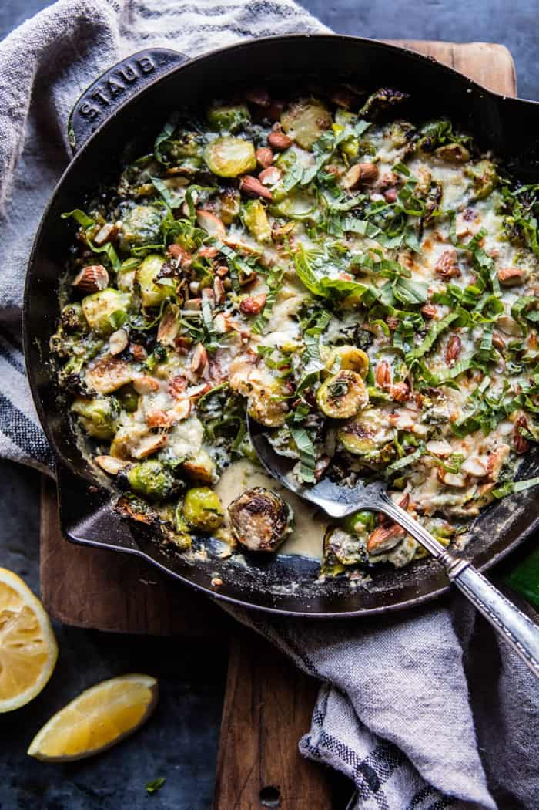

{width=100%}

**Prep Time:** 10 min | **Cook Time:** 20 min | **Total Time:** 30 min

## Ingredients

- 2 tablespoons extra-virgin olive oil
- ¾ pound Brussels sprouts, trimmed and halved
- 4  garlic cloves, minced or grated
- Zest of 1 lemon
- ⅔ cup full-fat goat’s milk
- 2 ounces goat cheese
- 1 teaspoon Dijon mustard
- 1 tablespoon fresh lemon juice
- Pinch of crushed red pepper flakes
- ¼ cup chopped fresh basil, plus more for garnish
- ⅓ cup grated Parmesan cheese
- ⅓ cup raw almonds, coarsely chopped
- Flaky sea salt and freshly ground black pepper

## Instructions

1. Preheat the oven to 400ºF.
1. In a 12-inch oven-safe skillet, heat the olive oil over medium. When it shimmers, add the Brussels sprouts and cook, stirring occasionally, until crisp and lightly caramelized, 3 to 4 minutes. Add the garlic and lemon zest and cook until fragrant, about 30 seconds, being sure not to burn them.
1. Transfer the skillet to the oven and roast the Brussels sprouts for about 10 minutes, or until tender.
1. Meanwhile, in a blender or food processor, combine the goat’s milk, goat cheese, mustard, and lemon juice and pulse until smooth. Stir in the red pepper flakes.
1. Remove the Brussels sprouts from the oven. Turn the broiler to high. Stir the basil and mint into the Brussels sprouts. Pour the goat’s milk mixture on top. Sprinkle with the Parmesan and almonds. Return to the oven and broil for 2 to 3 minutes, or until the cheese has melted, keeping a close eye on it. Remove and season lightly with flaky sea salt and pepper. Garnish with fresh basil and mint.

