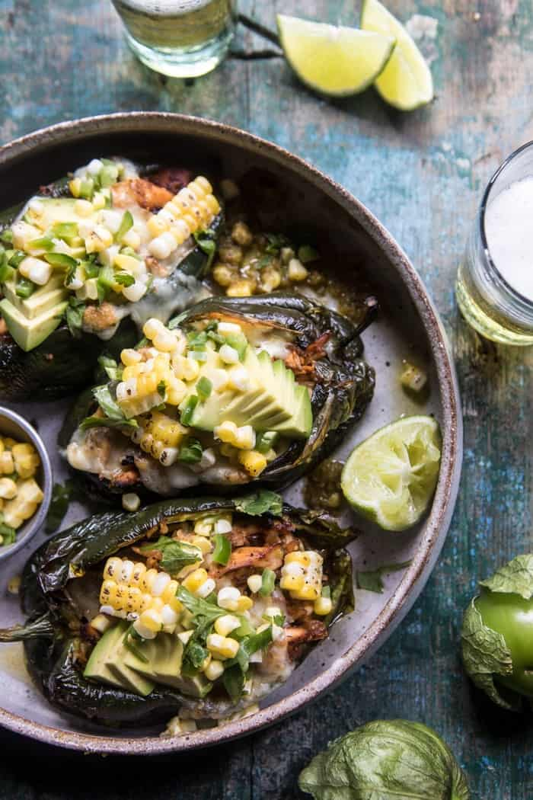

{width=100%}

**Prep Time:** 20 min | **Cook Time:** 40 min | **Total Time:** 1 hr

## Ingredients

- 1 pound boneless skinless chicken tenders or small breasts
- 2 tablespoons olive oil
- 2 teaspoons chili powder
- 1 teaspoon smoked paprika
- kosher salt and pepper to taste
- 6  poblano peppers
- 2 cups homemade or store bought salsa verde
- 1 cup cooked brown rice or quinoa
- 1/2 cup fresh cilantro, chopped
- 2 cups shredded pepper jack
- 1  avocado diced or sliced
- 2  ears of corns, kernels removed
- 1  jalapeno, seeded + chopped
- juice of 1 lime
- 1/3 cup fresh cilantro, chopped

## Instructions

1. Preheat the oven to 350 degrees F.
1. Place the chicken on a baking sheet and rub with the olive oil, chili powder, and paprika. Season with salt and pepper. Add the whole poblanos to the baking sheet. Transfer to the oven and bake for 20 minutes or until the chicken is cooked through. Remove the peppers from the pan and set aside.
1. Shred the chicken with two forks. Add 1/2 cup salsa verde, the rice, 1 cup cheese, the cilantro, and toss to combine. Pour 1/2 cup of the salsa verde onto the bottom of a 9x13 inch baking dish.
1. Cut a slit down the length of each poblano pepper. Using your fingers remove, and then discard the seeds from each pepper. Stuff the chicken mixture inside the peppers and arrange in the the prepared baking dish. Pour the remaining salsa verde over top of the peppers and then top with the remaining the cheese. Transfer to the oven and bake for 15-20 minutes, until the cheese has melted. Remove and top with the Avocado Corn Salsa.

