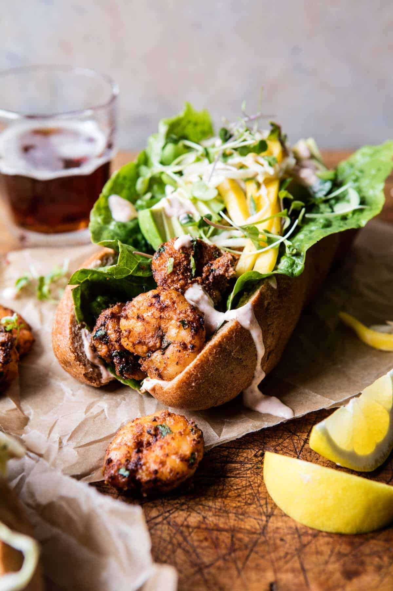

{width=100%}

**Prep Time:** 20 min | **Cook Time:** 10 min | **Total Time:** 30 min

## Ingredients

- 1 1/2 pounds shrimp, peeled
- 1 tablespoon creole seasoning
- 1 teaspoon smoked paprika
- 1 teaspoon cayenne pepper
- 1 teaspoon garlic powder
- 1/2 teaspoon onion powder
- 1/2 teaspoon dried thyme
- 2 tablespoons olive oil
- 4  whole wheat hoagie rolls
- 1 cup plain greek yogurt
- 2 tablespoons hot sauce
- juice of 1 lemon
- 1/2 teaspoon smoked paprika
- kosher salt and pepper
- 1/2 cup shredded cabbage
- 1  mango, thinly sliced into matchsticks
- 1  avocado, diced or sliced
- 1/2 cup fresh cilantro or basil (chopped)

## Instructions

1. In a medium bowl, combine the shrimp, creole, paprika, cayenne, garlic powder, onion powder, thyme and olive oil. Let sit while you make the slaw or place in the fridge up to overnight.
1. Make the slaw. In a small bowl, combine the yogurt, hot sauce, lemon juice, paprika, and a pinch each of salt and pepper. Taste and adjust spices to your liking. In a large bowl, toss together the cabbage, mango, avocado, and cilantro. Add 2-3 tablespoons of the yogurt sauce, gently tossing to combine. Reserve the remaining yogurt for serving.
1. Heat a large skillet over medium high heat. Add the shrimp in a single layer and cook, stirring once or twice until the shrimp have turned pink and are cooked through.
1. To assemble. Divide the shrimp among the hoagie rolls and drizzle with yogurt sauce. Top with slaw. Enjoy!

