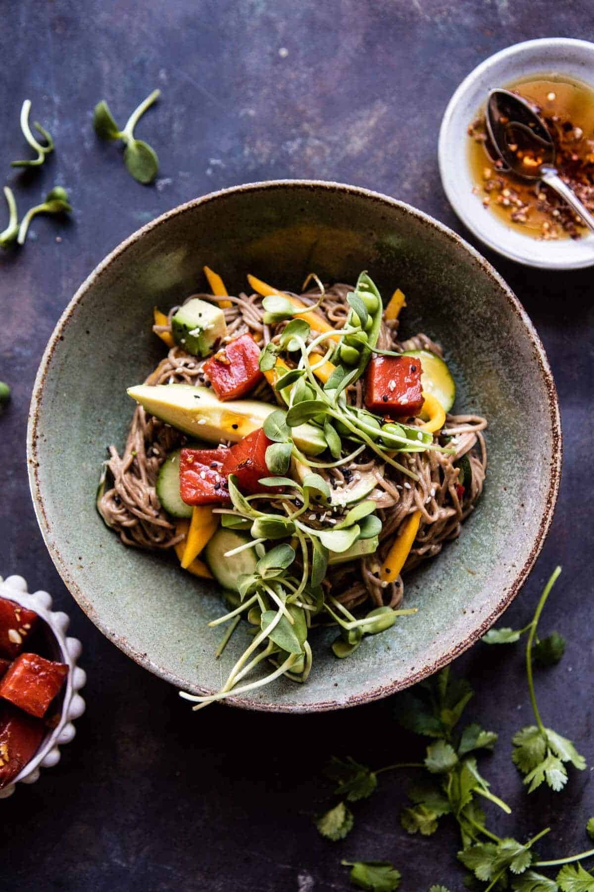

{width=100%}

**Prep Time:** 15 min | **Cook Time:** 5 min | **Total Time:** 20 min

## Ingredients

- 1/4 cup low-sodium soy sauce
- 1 tablespoon rice wine vinegar
- 1 tablespoon honey
- 1 inch fresh ginger, grated
- 1 clove garlic, minced or grated
- 1 pound sushi grade salmon (cut into chunks)
- 12 ounces soba noodles
- 3 tablespoons sesame oil
- 4  green onions, chopped
- 1/4 cup tahini
- juice of 1/2 a lemon
- 2 tablespoons oyster sauce
- 1  mango, cut into matchsticks
- 1 cup snap peas
- 1  avocado, diced
- 1  Persian cucumber, sliced
- sprouts, sesame seeds, and or hot chili sauce for serving

## Instructions

1. 

