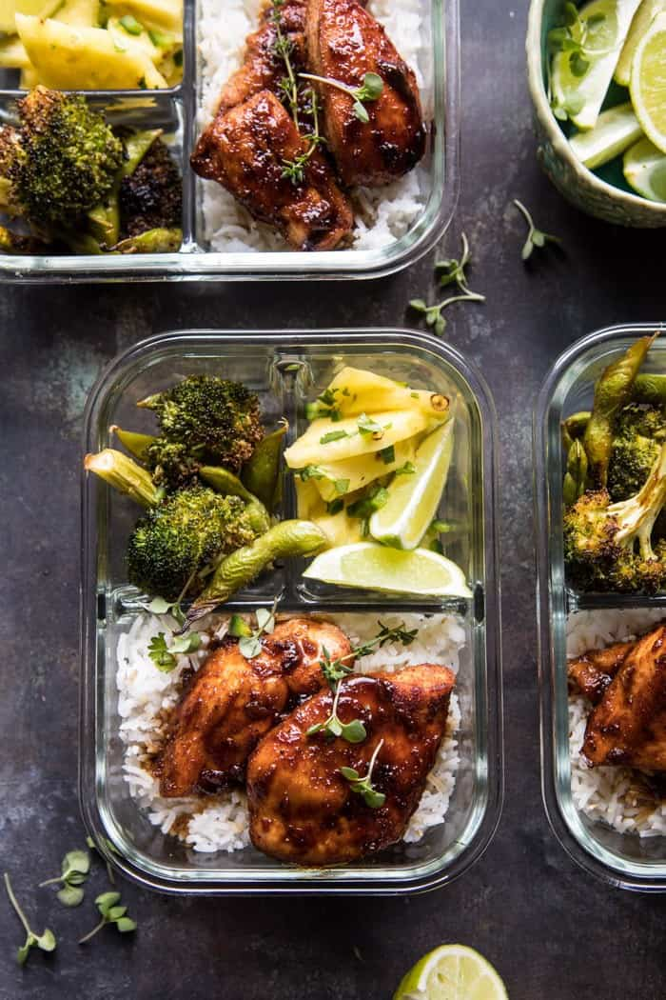

{width=100%}

**Prep Time:** 15 min | **Cook Time:** 25 min | **Total Time:** 40 min

## Ingredients

- 1/3 cup low sodium soy sauce
- 1/3 cup pineapple juice
- 1/3 cup honey
- 2 tablespoons grated fresh ginger
- 1 tablespoon jerk seasoning
- 2 tablespoons sesame oil
- 1 1/2 pounds boneless chicken breasts
- 2  heads broccoli, cut into florets
- 2 cups frozen edamame
- 4 cups coconut rice
- 2 cups chopped pineapple
- 1  jalapeño, chopped
- 1/4 cup fresh cilantro, chopped
- juices from 1 lime or lemon

## Instructions

1. Preheat the oven to 425 degrees F.
1. In a bowl, combine the soy sauce, pineapple juice, honey, 1 tablespoon ginger, 1 clove garlic, and 1 tablespoon sesame oil.
1. On a baking sheet, toss the chicken with the jerk seasoning and half of the teriyaki sauce. Slide the chicken to one side of the baking sheet. On the opposite side, toss the broccoli and edamame with the remaining 1 tablespoon ginger, and 1 tablespoon sesame oil. Season with salt and pepper. Transfer to the oven and roast for 15-20 minutes or until the chicken is cooked through and the broccoli lightly charred.
1. Meanwhile, transfer the remaining teriyaki sauce to small sauce pan and bring to a boil over high heat. Simmer 3-5 minutes or until the sauce thickens slightly.
1. Divide the rice among 4-6 storage containers and arrange the chicken, and veggies on top. Drizzle the chicken with the teriyaki sauce. Alternately, you can store the rice, chicken, and veggies in separate containers and assemble when ready. Food will keep in the fridge for up to 1 week.
1. Before serving, warm each bowl, if desired, and top with pineapple salsa and fresh lemon or lime juice.

