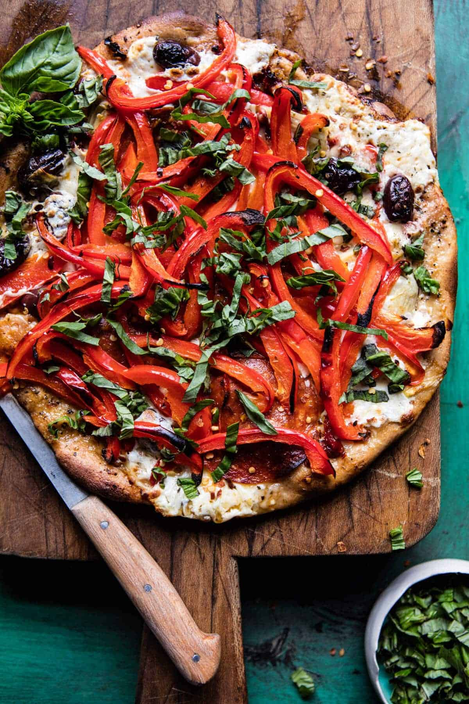

{width=100%}

**Prep Time:** 15 min | **Cook Time:** 15 min | **Total Time:** 30 min

## Ingredients

- 1/2 pound pizza dough
- 2 tablespoons olive oil
- 2  garlic, minced or grated
- 1 teaspoon dried basil
- 1 teaspoon dried oregano
- 1/2 teaspoon crushed red pepper flakes
- kosher salt and pepper
- 1/2 cup pitted kalamata olives
- 1/3 cup oil packed sun-dried tomatoes, oil drained and sliced
- 1/4 cup marinated artichokes, drained
- 8 ounces mozzarella, torn or shredded
- 1/2 cup shredded fontina cheese
- 4-8  pepperoni slices (optional)
- 2  red bell peppers, very thinly sliced
- fresh basil, for topping

## Instructions

1. Preheat oven to 425 degrees F. Grease a baking sheet with olive oil.On a lightly floured surface, push/roll the dough out until it is very thin. For SUPER thin pizza, divide the dough into two and roll out. Transfer the dough to the prepared baking sheet. Spread the dough with olive oil. Add the garlic, basil, oregano, crushed red pepper flakes, and a pinch each of salt and pepper. Spread evenly over the dough. Add the olives, sun-dried tomatoes, artichokes, and cheese. Top with pepperoni and bell peppers. Transfer to the oven and bake 10-15 minutes or until the crust is crisp and the cheese has melted. Remove the pizza from the oven and top with basil. EAT!

