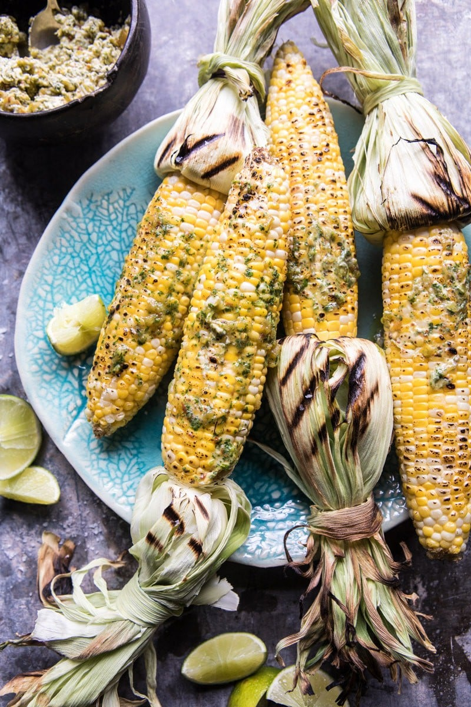

{width=100%}

**Prep Time:** 10 min | **Cook Time:** 20 min | **Total Time:** 30 min

## Ingredients

- 6 ears corn
- 1 stick (8 tablespoons) unsalted butter
- 1 4.5 ounce can Old El Paso Chopped Green Chiles, drained
- 1  chipotle pepper in adobo
- 1/4 cup fresh cilantro
- 2 teaspoons honey
- 1/2 teaspoon ground cumin
- 1 teaspoon kosher salt, plus more if needed

## Instructions

1. Preheat the grill to medium high heat.
1. Pull the outer husks of the corn down to the base and strip away the silk. Fold husks back into place to cover the kernels.
1. Grill for about 5 minutes on each “side” – rotating corn 4-5 times. Once the corn is finished, remove the husk and place back on the grill until lightly charred, about 5 more minutes.
1. Meanwhile, add the butter, chopped green chiles, chipotle pepper in adobo, cilantro, honey, cumin, and a large pinch of salt to the bowl of a food processor and pulse until combined.
1. Spread the butter over the warm corn. Serve with salt, cilantro, and limes. Eat!

