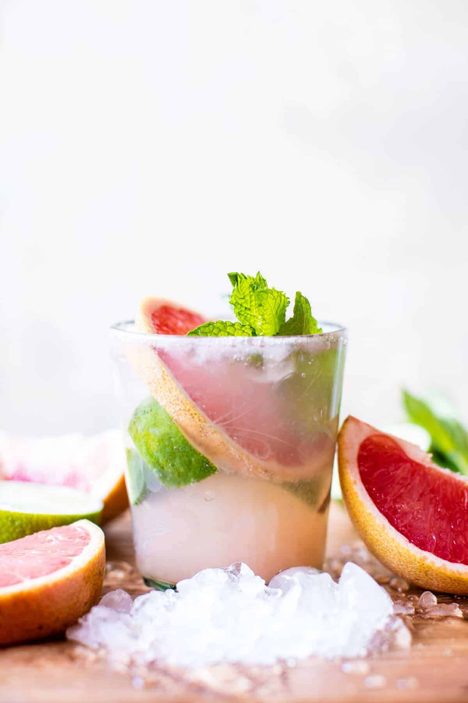

{width=100%}

**Prep Time:** 5 min | **Cook Time:**  | **Total Time:** 5 min

## Ingredients

- 1-2 teaspoons honey or sugar (optional)
- 1  lime, quartered
- 6  fresh mint leaves
- crushed ice
- juice of 1/2 a grapefruit
- 2 ounces Cachaça or white rum
- sparkling water, for topping

## Instructions

1. In a glass, muddle 1-2 teaspoons sugar or honey (if using), the quartered lime and mint leaves. Add the ice, the grapefruit juice and the Cachaça, gently mix to combine. Pour sparkling water over top. DRINK! ?

