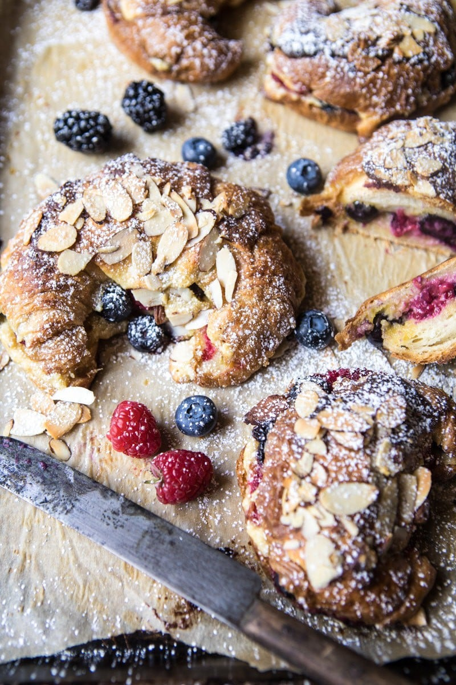

{width=100%}

**Prep Time:** 20 min | **Cook Time:** 15 min | **Total Time:** 35 min

## Ingredients

- 2 tablespoons honey
- 1/4 cup bourbon  ((optional))
- 2 pinches kosher salt
- 8 tablespoons unsalted butter, softened
- 2  eggs
- 1 teaspoon vanilla extract
- 1 1/4 cups almond meal  ((finely ground almonds))
- 8  plain croissants, homemade or store-bought
- 2 cups mixed berries
- 1/4 cup flaked almonds

## Instructions

1. Preheat the oven to 350 degrees F. Line a baking sheet with parchment paper.
1. In a small sauce pan, combine 1 cup water with the honey and bourbon, if using. Add a pinch of salt and bring to a boil over high heat. Once boiling remove from the heat and set aside.
1. In a medium bowl, beat together the butter, eggs, and vanilla until creamy. Add the almond meal and a pinch of salt and mix until combined.
1. Cut the croissants in half lengthwise and using a pastry brush, brush each piece lightly with the honey Bourbon mixture. Spread the bottom half the the croissant with almond cream and the top with enough berries to almost cover the surface of the croissant. Add the top half and place on the prepared baking sheet. Repeat with the remaining croissants, reserving 1/4 cup cream for topping. Spread the remaining cream over top of the croissants and top with flaked almonds. Transfer to the oven and bake for 12-15 minutes or until the croissants are golden. Remove from the oven and let sit on the pan for 5 minutes. Dust generously with powered sugar. Eat!

