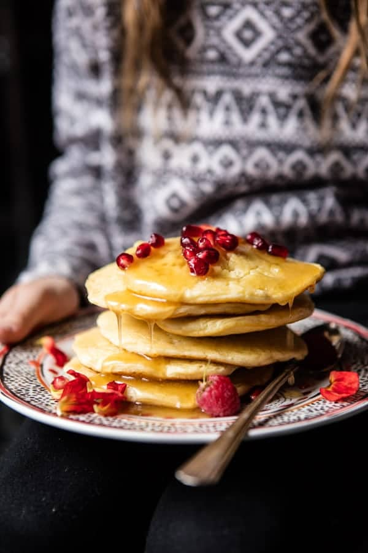

{width=100%}

**Prep Time:** 15 min | **Cook Time:** 10 min | **Total Time:** 25 min

## Ingredients

- 1 cup all purpose flour
- 1 cup semolina flour
- 2 teaspoons baking powder
- 1 1/2 teaspoons instant yeast
- 1/2 teaspoon salt
- 2  eggs
- 1 1/2 cups warm milk
- 1/2 cup honey
- 4 tablespoons salted butter

## Instructions

1. In a medium mixing bowl, combine the flour, semolina flour, baking powder, instant yeast, and salt. Add the eggs and milk and mix until just combined. Let the better sit 10 minutes or up to overnight, covered in the fridge. Bring to room temp before serving.
1. Heat a large skillet or griddle over medium heat and lightly grease with oil. Pour about 1/4 cup batter onto the center of the hot pan. Cook until bubbles appear and the surface is no longer shiny, do not flip these. Repeat with the remaining bater.
1. In a small saucepan, melt together the honey and butter.
1. Serve the pancakes warm, drizzled with honey butter and a side of fruit.

