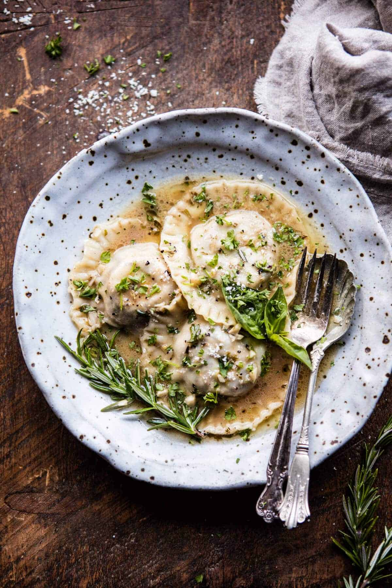

{width=100%}

**Prep Time:** 45 min | **Cook Time:** 15 min | **Total Time:** 1 hr

## Ingredients

- 2 tablespoons butter
- 16 ounces cremini mushrooms (chopped)
- 1 tablespoon chopped fresh thyme
- 2 tablespoons balsamic vinegar
- 1 cup whole milk ricotta cheese
- 1 cup shredded fontina cheese
- 1/2 cup grated parmesan cheese
- kosher salt + pepper
- 40-50  circle or square wonton wrappers
- 8 tablespoon salted butter
- 3 cloves garlic (minced or grated)
- 1 tablespoon chopped fresh rosemary (plus more for serving)
- 1/2 cup white wine or chicken broth
- 2 cups low sodium chicken broth
- chopped parsley (for serving)

## Instructions

1. Melt the butter in a large skillet set over medium high heat. Add the mushrooms and cook until soft and caramelized, about 5 minutes. Add the thyme and season with salt and pepper. Add the balsamic vinegar and cook until the balsamic coats the mushrooms, about 3-4 minutes. Remove from the heat and let cool completely.
1. In a medium bowl, stir together the ricotta, fontina, and parmesan. Season with salt and pepper. Fold in the mushrooms.
1. Lay out about 6 wrappers. Spoon 1 tablespoon of filling into the center of each wrapper. Brush the edges with water. Lay a second wrapper on top of each ravioli. Press down the edges to seal, pressing out all the air. Crimp the edges with a fork. Alternately you can create triangles with the square wrappers if desired. Be sure to keep the ravioli's covered as work work to prevent them from drying out.
1. Make the butter sauce. In a large skillet, brown the butter over medium heat, stirring often until the butter is golden and toasted. Add the rosemary and garlic and cook 30 seconds to a minute or until fragrant. Pour in the wine and chicken broth and bring to a boil. Season with salt and pepper. Cook 5 minutes or until the sauce has reduced slightly.
1. Meanwhile, bring a large pot of salted water to a boil. Boil the ravioli in batches for 1-2 minutes or until they float. Drain.
1. Divide the ravioli among bowls and ladle the sauce over the ravioli. Top with parmesan and parsley. EAT!

