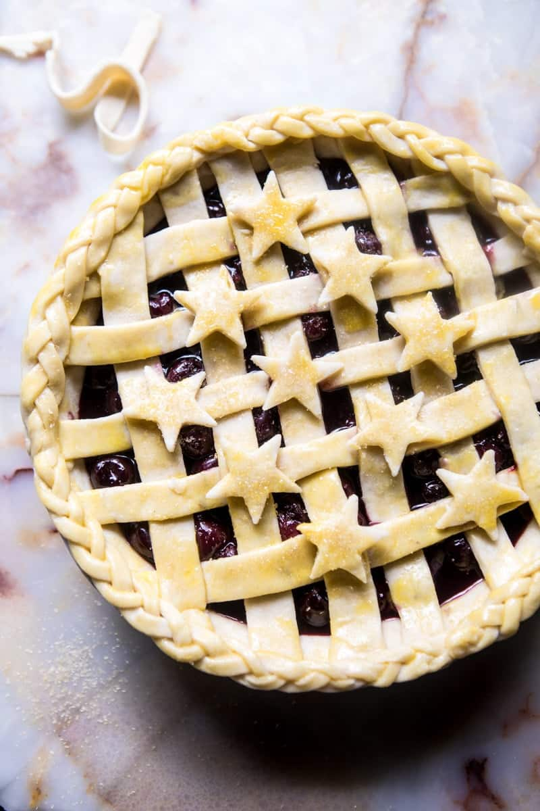

{width=100%}

**Prep Time:** 15 min | **Cook Time:**  | **Total Time:** 15 min

## Ingredients

- 2 1/2 cups all-purpose flour, plus more for rolling
- 1/3 cup almond flour
- 1 teaspoon kosher salt
- 1 cup chilled unsalted butter, cut into small cubes
- 1/3 cup cold buttermilk, plus more if needed

## Instructions

1. Place the flour, almond flour, and salt in a large bowl. Add butter and use your fingers or a pastry cutter to work the butter into the flour until the mixture resembles small peas.
1. Pour in the buttermilk and mix with a spatula, drizzling in more buttermilk as needed (no more than 1 tablespoon at a time), until the dough just comes together (a few dry spots are ok). Turn the dough out onto a floured surface and gently knead until no dry spots remain, about 1 minute.
1. Divide the dough in half. Shape each piece into a circular disk. Wrap the dough in plastic wrap. At this point you can place the dough in the fridge for up to one week or use as directed in your recipe.

