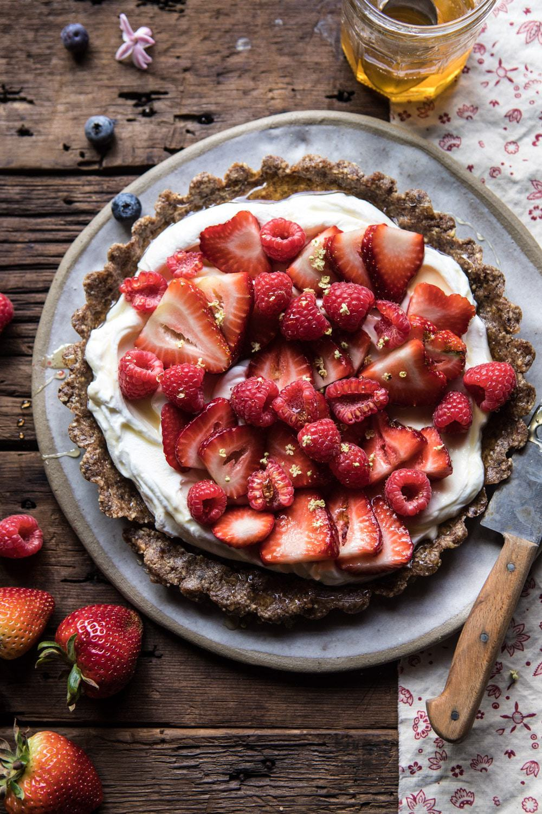

{width=100%}

**Prep Time:** 15 min | **Cook Time:** 10 min | **Total Time:** 25 min

## Ingredients

- 2 cups raw pecans
- 10  Medjool dates, pitted
- 1 pinch flaky salt
- 1 ½ cups plain Greek yogurt
- 1 cup fresh raspberries, blueberries, or blackberries
- 6  strawberries, sliced
- 2 tablespoons honey

## Instructions

1. To make the crust. In a food processor, pulse the pecans until ground into a semi-fine meal. Add the dates and salt and pulse until the mixture holds together when pinched and starts to look like dough.
1. Press the dough into an 8 or 9 inch tart pan with a removable bottom to form a flat, even crust. Chill in the freezer for 10 minutes or up to 1 week.
1. To make the filling. Remove the crust from the freezer and carefully slide it onto a serving plate. Spread the yogurt over the crust. Top the yogurt with the berries, then drizzle with honey. Slice and serve.

