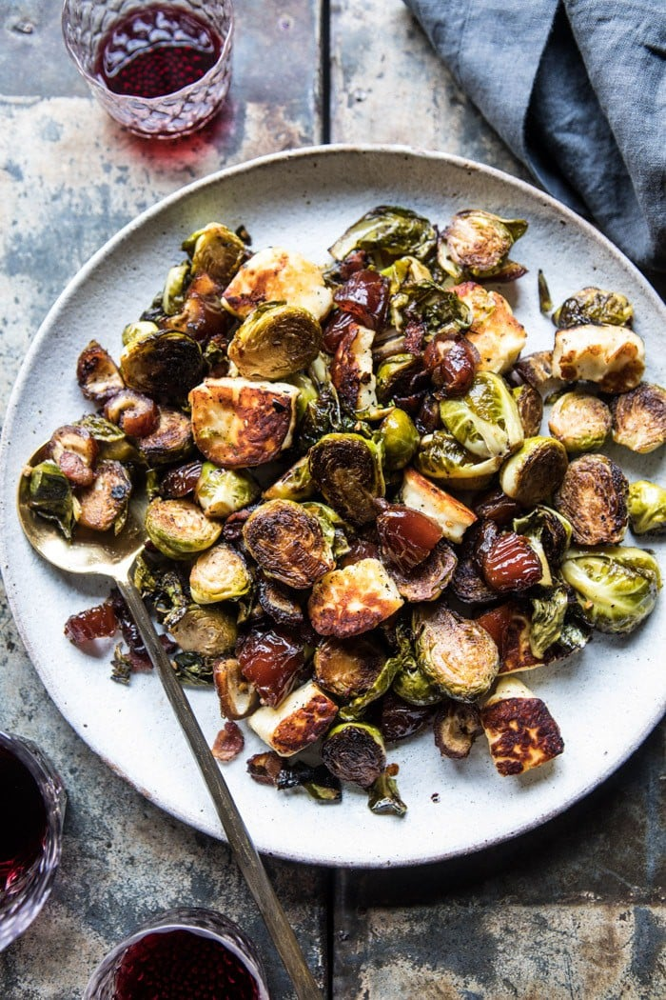

{width=100%}

**Prep Time:** 15 min | **Cook Time:** 25 min | **Total Time:** 40 min

## Ingredients

- 2 slices thick cut bacon, chopped
- 1 pound brussels sprouts, halved
- 3 tablespoons extra virgin olive oil
- kosher salt and pepper
- 1/2 teaspoon crushed red pepper flakes
- 1/3 cup medjool dates, pits removed and chopped
- 1/4 cup red wine vinegar
- 8 ounces Halloumi cheese, cubed

## Instructions

1. Heat a large 12-inch skillet over medium high heat. Add the bacon and cook until crisp and the fat has rendered, about 5 minutes. Remove the bacon from the skillet and drain on a pepper towel lined plate.
1. Add 2 tablespoons olive oil to the skillet with the bacon grease. When the oil shimmers, add the brussels sprouts, cut side down and cook until charred around the edges, about 5-8 minutes. It is OK if the brussels sprouts become blackened in some parts. Stir and season with salt and pepper. Continue cooking another 8-10 minutes or until the brussels sprouts are soft. Reduce the heat to medium and stir in the crushed red pepper flakes, dates, and red wine vinegar. Cook until the vinegar coats the brussels sprouts, about 1-2 minutes. Remove from the heat.
1. Heat a small skillet over medium heat and add 1 tablespoon olive oil. When the oil shimmers, add the Halloumi cheese and sear for 2-3 minutes per side until golden. Stir the cheese into the brussels sprouts. Serve warm. Enjoy!

