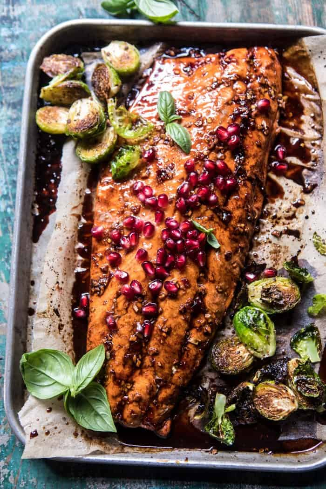

{width=100%}

**Prep Time:** 10 min | **Cook Time:** 20 min | **Total Time:** 30 min

## Ingredients

- 1 pound brussels sprouts, halved
- 2 tablespoons extra virgin olive oil
- kosher salt and pepper
- 2 tablespoons pomegranate molasses
- 2 tablespoons sweet chili sauce
- 2 tablespoons pomegranate juice
- 1 inch fresh ginger, grated
- 1 clove garlic, minced or grated
- 1 pinch red pepper flakes
- 1 pound wild caught salmon
- fresh basil for serving

## Instructions

1. Preheat oven to 425 degrees F.
1. On a large rimmed baking sheet, combine the brussels sprouts, olive oil, and a pinch each of salt and pepper. Toss well to evenly coat. Place in the oven and roast for 15 minutes.
1. Meanwhile, combine the pomegranate molasses, pomegranate juice, sweet chili sauce, ginger, garlic, and a pinch each of red pepper flakes and salt in a small bowl.
1. Remove the brussels sprouts from the oven. Add the salmon to the center of the pan. Spoon the pomegranate glaze over the salmon. Transfer to the oven and roast for 10-20 minutes or until the salmon has reached your desired doneness.
1. Top the salmon with pomegranate arils and fresh basil. Enjoy!

