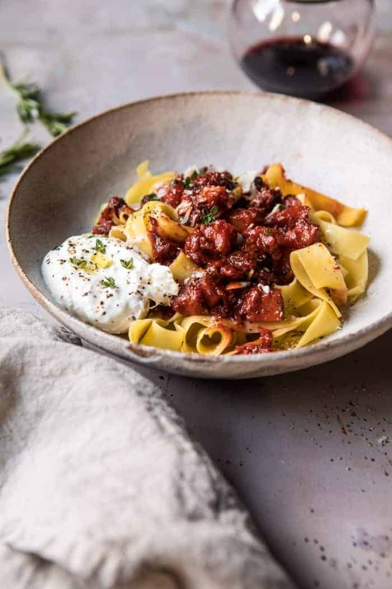

{width=100%}

**Prep Time:** 15 min | **Cook Time:** 45 min | **Total Time:** 1 hr

## Ingredients

- 2  tablespoons extra virgin olive oil
- 1 pound ground spicy Italian sausage
- 1/2  sweet onion, chopped
- 3  garlic cloves, smashed
- kosher salt and pepper
- 1 1/2 cups cubed butternut squash
- 1 can (28 ounce) San Marzano tomatoes
- 1/2 cup red wine
- 1  bay leaf
- 4  fresh sage leaves
- 2  fresh thyme sprigs
- 4 tablespoons butter
- 1 pound Pappardelle or your favorite cut of pasta
- burrata cheese and parmesan cheese, for serving

## Instructions

1. Preheat the oven to 425 degrees F.
1. Heat the olive oil in a large skillet set over medium heat. When the oil shimmers, add the sausage, onion, and garlic and cook until the sausage has browned all over, about 8-10 minutes. Season with salt and pepper. Stir in the butternut squash and continue cooking until the squash is golden on the edges, about 5 minutes. Remove from the heat and stir in all of the tomatoes, wine, bay leaf, sage, and thyme. Arrange the butter slices over top.
1. Transfer to the oven and roast for 30-35 minutes or until the squash is soft and the sauce thickened. Remove the bay leaf and thyme sprigs.
1. Meanwhile, bring a large pot of salted water to a boil. Cook the pasta according to package directions until al dente. Drain. Stir the pasta into the Ragu sauce.
1. Divide the pasta among plates and top with burrata and parmesan. EAT.

