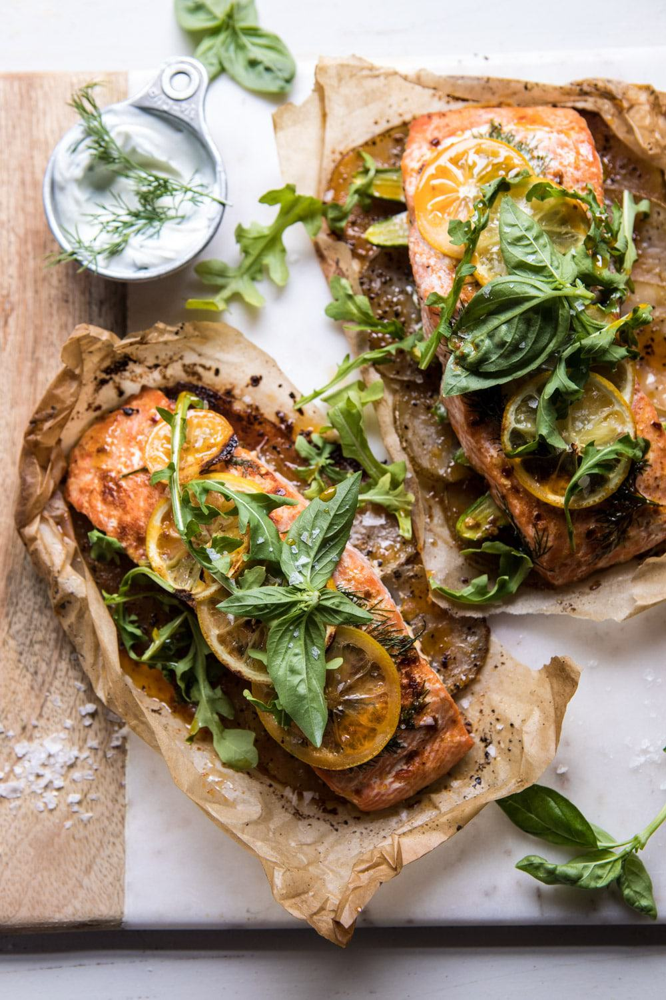

{width=100%}

**Prep Time:** 10 min | **Cook Time:** 20 min | **Total Time:** 30 min

## Ingredients

- 1/4 cup extra virgin olive oil
- 2 cloves garlic, minced or grated
- 2  lemons
- 1 tablespoon chopped fresh dill
- 2 teaspoons smoked paprika
- 2  small potatoes, very thinly sliced using a mandolin
- 4 6-8 ounce salmon fillets, skinned
- kosher salt and pepper
- fresh arugula and basil, for serving
- 1 cup plain greek yogurt
- 1 tablespoon chopped fresh dill
- juice of 1 lemon
- 1 pinch crushed red pepper flakes

## Instructions

1. Preheat the oven to 400 degrees F.  Fold 4 large pieces of parchment paper (about 15x16 inches) in half. Open, and lay on half flat.
1. In a small bowl, stir together the olive oil, garlic, juice of 1 lemon, dill, smoked paprika and a pinch of salt and pepper.
1. Working on one side of the creased parchment, layer the potatoes, and season with salt and pepper. Place the salmon over the potatoes and drizzle with the olive oil sauce, and top with 2 lemons slices. Repeat with the remaining ingredients to make 4 packets.
1. To close, fold the parchment over salmon, pinching to seal the open sides and create a half-moon-shaped packet. Place on a rimmed baking sheet. Transfer to the oven and bake until the potatoes are tender, about 18-20 minutes.
1. Meanwhile, in a medium bowl, stir together the yogurt, lemon juice, dill, and a pinch of crushed red pepper.
1. Serve the salmon topped with dill yogurt, arugula, and basil. Enjoy!

