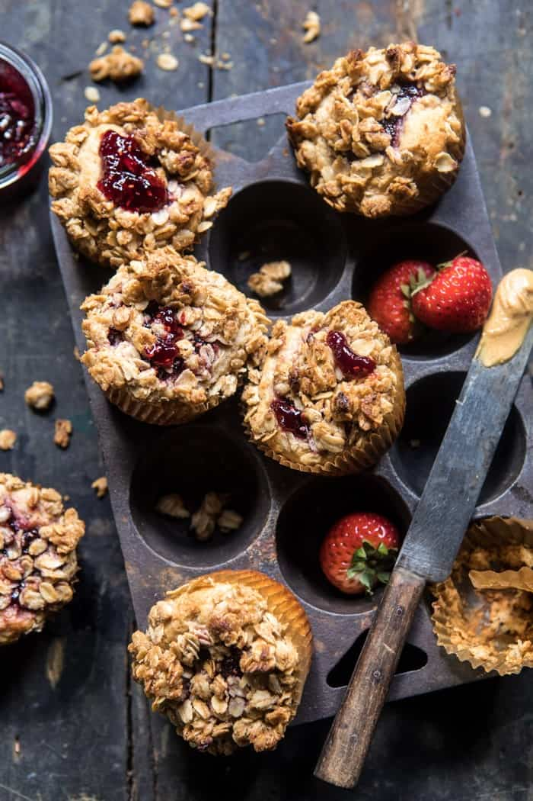

{width=100%}

**Prep Time:** 20 min | **Cook Time:** 20 min | **Total Time:** 40 min

## Ingredients

- 1/2 cup melted coconut oil or butter
- 1/2 cup honey
- 2 teaspoons vanilla extract
- 1 cup buttermilk
- 1 cup plain greek yogurt
- 2  eggs
- 1 1/2 cups all-purpose flour
- 1 cup white whole wheat flour
- 2 teaspoons baking powder
- 1/2 teaspoon kosher salt
- 1/2 cup creamy peanut butter
- 1/2 cup raspberry or strawberry jam
- 1 1/2 cups old fashioned oats
- 3 tablespoons all purpose flour
- 2 tablespoons brown sugar
- 1 teaspoon cinnamon
- 6 tablespoons softened salted butter, cubed

## Instructions

1. Preheat the oven to 350 degrees F. Line 18 muffin tins with paper liners.
1. In a large mixing bowl, whisk together the oil, honey, vanilla, buttermilk, greek yogurt, and eggs until smooth. Add the flour, whole wheat flour, baking powder, and salt and mix until just combined.
1. Gently fold the peanut butter into the batter, being careful not to over mix. Remember, you're going for a peanut butter swirl look.
1. Divide the batter evenly among the prepared muffins tins. Using a spoon, make a teaspoon side indent in the middle of each muffin and spoon the jam into each.
1. To make the streusel. Combine the oats, flour, brown sugar, cinnamon and salt in a medium size mixing bowl. Add the butter and use your hands to work the butter into the dry ingredients until everything is moist and clumps together. Sprinkle the topping over muffins. Transfer to the oven and bake for 20-25 minutes or until a toothpick inserted into the center comes out clean. Enjoy!!

