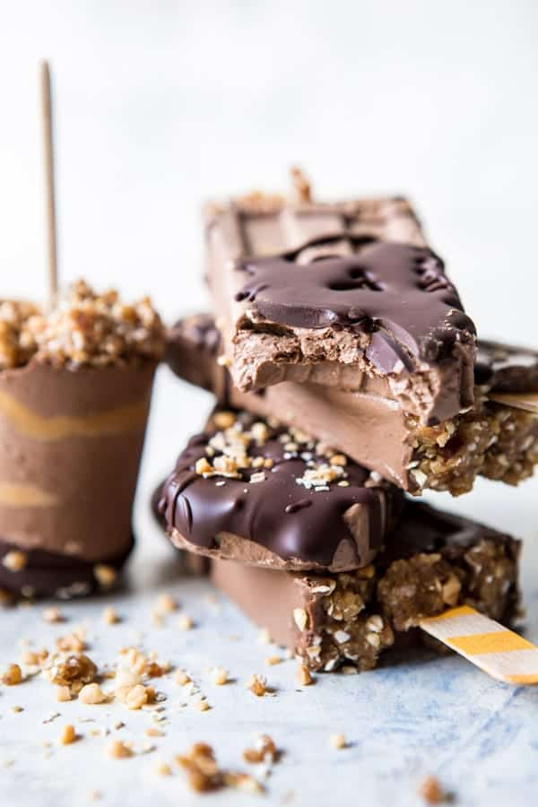

{width=100%}

**Prep Time:** 15 min | **Cook Time:**  | **Total Time:** 15 min

## Ingredients

- 1 (14 ounce) can full fat canned coconut milk
- 1/4 + 1/3 cup creamy peanut butter
- 2  ripe bananas
- 6-8 dates + 1/3 cup pitted medjool dates
- 1/2 cup cacao or cocoa powder
- 3 tablespoons hemp seeds
- 2 teaspoons vanilla extract
- 1/2 cup rolled oats
- 1/2 cup roasted peanuts
- 8 ounces dark chocolate, melted

## Instructions

1. In a high powder blender or food processor, combine the coconut milk, 1/4 cup peanut butter, bananas, 6-8 dates, cacao powder, hemp seeds, and vanilla and blend until completely smooth and the consistency of a thick smoothie.
1. To assemble, layer the chocolate mix and the remaining 1/3 cup peanut butter evenly among 10-12 popsicles molds. It's OK if the layers are not perfect.
1. To make the granola: in a food processor, combine the remaining 1/3 cup dates, oats, and peanuts and pulse until the mix is finely ground and resembles granola. Sprinkle the "granola" over the tops of the pops, gently pressing into the pops (you will not use all the "granola"). Insert popsicle sticks, cover the tops of the mold and freeze until firm, about 4 hours. To remove the popsicles run the mold under hot water for 10 seconds and then pull the popsicles out of the molds.
1. If desired, dip each popsicle in chocolate and then quickly sprinkle with the remaining "granola". Store in the freezer.

