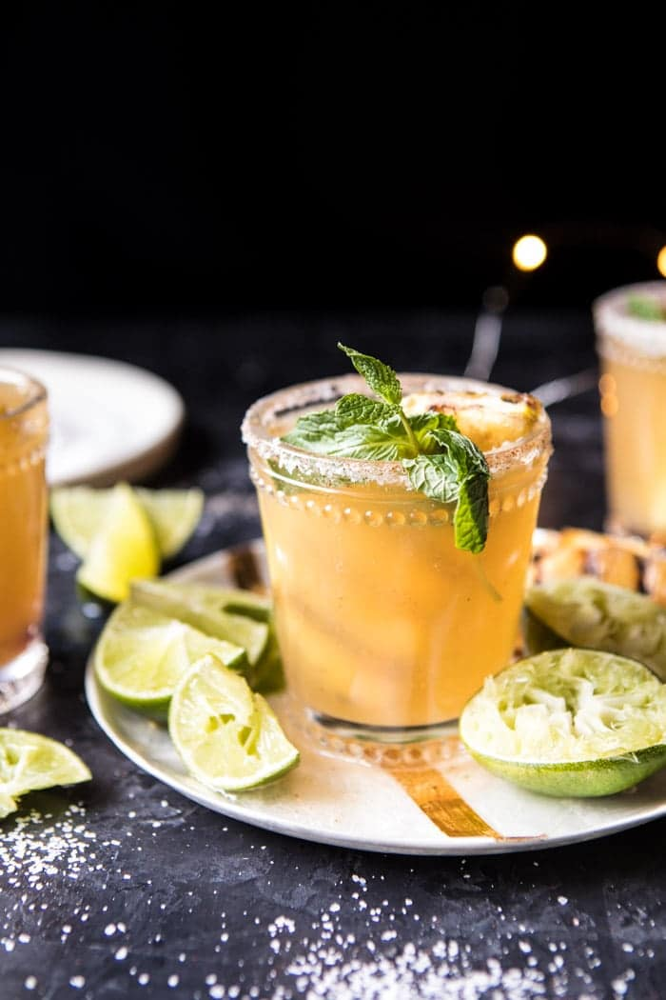

{width=100%}

**Prep Time:** 10 min | **Cook Time:**  | **Total Time:** 10 min

## Ingredients

- 1 cup fresh pineapple chunks
- 1 cup fresh lime juice
- 1/4 cup fresh lemon juice
- 1 cup silver tequila
- 1/2 cup Grand Marnier ((orange liqueur))
- 1 bottle (750 ml) champagne
- fresh mint, for serving
- 1/4 cup kosher or margarita salt
- 1 teaspoon chipotle chili powder

## Instructions

1. In a blender, combine the pineapple, lime juice, and lemon juice and pulse to combine. Strain into a pitcher. Add the tequila and Grand Marnier. Chill until ready to serve.
1. Just before serving, add the champagne. Rim glasses with chili salt and divide the margaritas among glasses. Top with fresh or grilled pineapple slices and mint. Enjoy!

