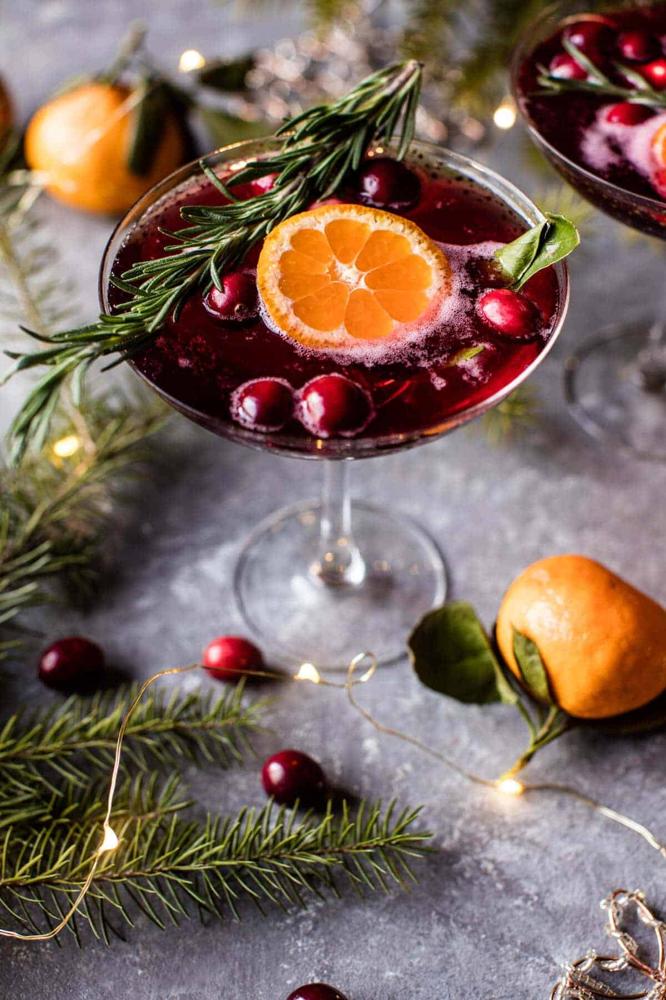

{width=100%}

**Prep Time:** 10 min | **Cook Time:**  | **Total Time:** 10 min

## Ingredients

- 3/4 cup vodka
- 1 1/2 cups 100% cranberry juice or pomegranate juice
- 2 ounces St. Germain (elderflower liquor)
- 3/4 cup champagne
- 1 cup fresh cranberries
- slices rosemary and orange (for serving)

## Instructions

1. In a large pitcher, combine the vodka, cranberry juice and St. Germain. Chill until ready to serve.
1. When ready to serve, add the champagne and cranberries. Pour among glasses and garnish with rosemary and orange zest/slices.

