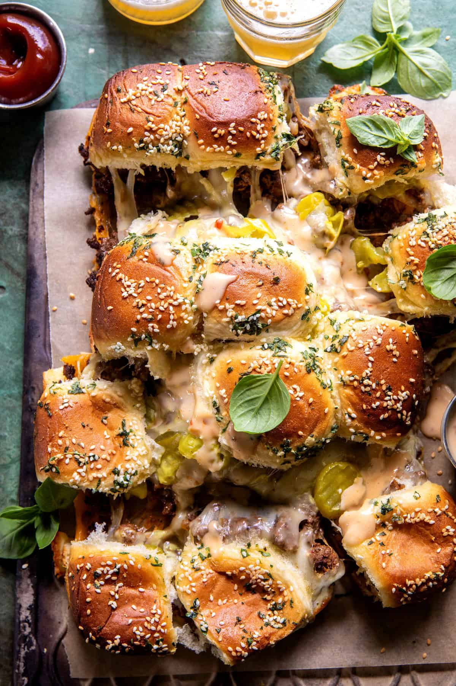

{width=100%}

**Prep Time:** 20 min | **Cook Time:** 30 min | **Total Time:** 50 min

## Ingredients

- 1/2 cup mayo
- 1/3 cup sweet Thai chili sauce
- 2 tablespoons tamari/soy sauce
- 1 tablespoon ketchup
- 1  clove, garlic grated
- 1 pound ground beef, chicken, or turkey
- 2-3 tablespoons Gochujang  ((Korean chili paste))
- 2 teaspoons Worcestershire sauce
- 1 teaspoon onion powder
- 1 teaspoon garlic powder
- salt and black pepper
- 1 package (12 count)  dinner rolls, halved lengthwise
- 4-6 slices sharp cheddar cheese
- 1 cup  shredded spicy cheddar or pepper jack
- 1/4 cup dill pickles and or pepperoncini
- 3 tablespoons salted butter, at room temperature
- 4-6 cloves garlic, chopped
- 1 tablespoon chopped fresh basil or parsley
- 2 tablespoons grated parmesan cheese
- 2 tablespoons sesame seeds

## Instructions

1. To make the sauce: combine all ingredients in a bowl.
1. Preheat the oven to 400° F.
1. In a skillet set over medium heat, cook the meat until browned all over, breaking up the meat as it cooks. Add the Gochujang, Worcestershire sauce, onion powder, garlic powder, and season with salt and pepper. Cook for 2-3 minutes more. Remove from the heat.
1. Place the bottom half of the dinner rolls onto a baking sheet lined with parchment paper. Layer with cheddar cheese, then spoon the meat over the cheese. Drizzle 1/3 cup special sauce over the meat. Add the shredded cheddar/pepperjack. Arrange pickles and/or pepperoncini over the cheese.
1. In a bowl, mix together the butter, garlic, herbs, and parmesan. Spread the butter over top of the rolls, reserving extra for serving. Sprinkle with sesame seeds. Cover the rolls with tin foil and bake for 10-15 minutes. Remove the foil and continue baking another 10-15 minutes until the cheese has melted.
1. Brush with any remaining garlic butter and serve immediately with additional special sauce - of course!

