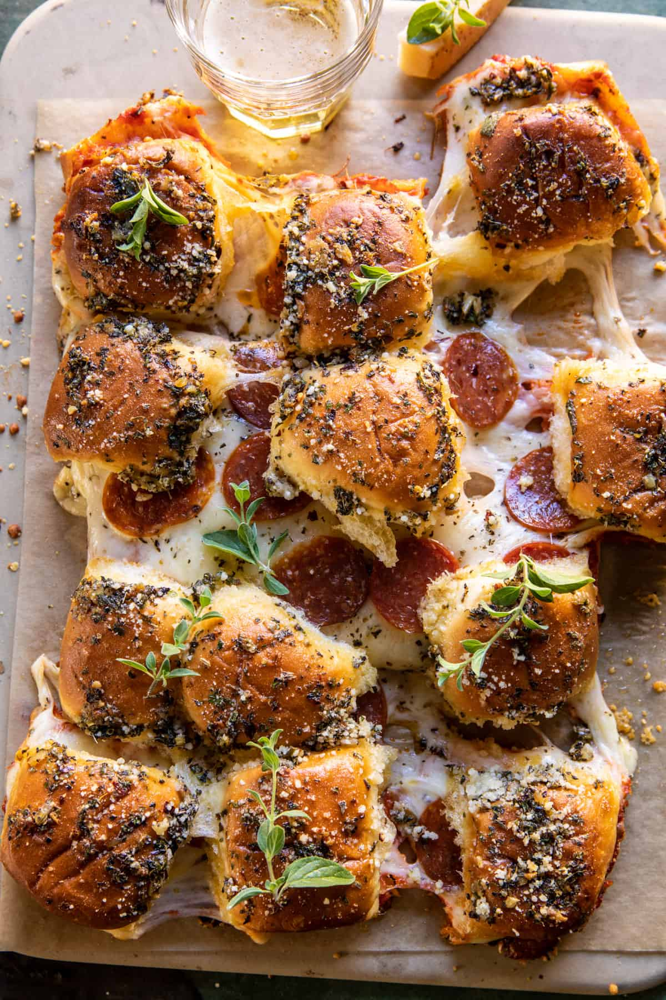

{width=100%}

**Prep Time:** 15 min | **Cook Time:** 1 hr | **Total Time:** 1 hr 15 min

## Ingredients

- 1 head garlic
- extra virgin olive oil
- 1 (12-count) package  dinner rolls, halved lengthwise
- 1 - 1 1/2 cups marinara sauce
- 3/4 cup shredded mozzarella cheese
- 3/4 cup shredded provolone cheese
- 1/4 cup grated parmesan cheese
- 1/2 cup thinly sliced pepperoni
- 3 tablespoons salted butter, at room temperature or melted
- 1 tablespoon chopped fresh sage
- 2 teaspoons dried basil
- 1 teaspoon dried oregano
- 1 teaspoon dried parsley
- 1 pinch chili flakes

## Instructions

1. Preheat the oven to 400° F.
1. Slice off the top portion of the garlic head to expose some of the cloves. Place the garlic on a piece of foil. Drizzle with olive oil, wrap it up, and bake for 40-55 minutes, until deeply golden and very soft.
1. Meanwhile, place the bottom half of the dinner rolls onto a baking sheet lined with parchment. Top with marinara sauce, mozzarella, provolone, and then pepperoni. Sprinkle with half the parmesan. Place the top half of the roll over the cheese. 4. Let the garlic cool, then squeeze the cloves out into a bowl. Add the butter, remaining parmesan, sage, basil, oregano, parsley, and chili flakes. Mash the cloves into the butter with a fork. Spread the butter over the top of the rolls. Cover the rolls and bake 10 minutes. Remove the foil and continue baking another 10 minutes, until the cheese has melted.
1. Brush with any remaining garlic butter, serve immediately.

