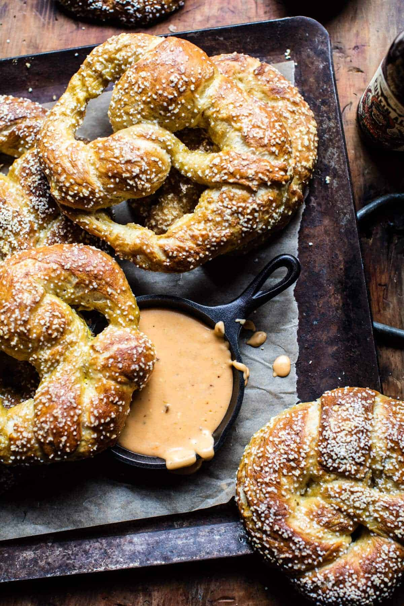

{width=100%}

**Prep Time:** 15 min | **Cook Time:** 25 min | **Total Time:** 40 min

## Ingredients

- 1/2 cup warm water
- 2 tablespoons light brown sugar
- 2 1/4 teaspoons active dry yeast
- 1 cup pumpkin beer (or any beer you love)
- 1/2 cup (1 stick) unsalted butter (melted)
- 1 1/2 teaspoons kosher salt
- 4 1/2 cups all-purpose flour
- 1/4 cup baking soda (for boiling the pretzels)
- 1  egg (beaten, for brushing before baking)
- coarse sea salt or pretzel salt
- 1 tablespoon butter
- 4 ounces cream cheese (at room temperature)
- 1 1/2 cups whole milk
- 12 ounces sharp cheddar cheese (shredded)
- 1 tablespoon all-purpose flour
- 2  chipotle peppers adobo (finely minced)

## Instructions

1. Combine the water, brown sugar and yeast in the bowl of a stand mixer and mix with the dough hook until combined. Let sit for 5 minutes.
1. Add the beer, melted butter, salt and all-purpose flour to the mixture and mix on low speed until combined. Increase the speed to medium and continue kneading until the dough is smooth and begins to pull away from the sides of the bowl, about 3 to 4 minutes. If the dough appears too wet, add additional flour, 1 tablespoon at a time. Remove the dough from the bowl, place on a flat surface and knead into a ball with your hands. Coat a large bowl with canola oil, add the dough and turn to coat with the oil. Cover with a clean towel or plastic wrap and place in a warm spot until the dough doubles in size. This will take about 1 hour.
1. Preheat the oven to 425 degrees F. Bring a large pot of water to a boil.
1. Remove the dough from the bowl and place on a flat surface. Divide the dough into 8 equal pieces. Roll each piece into a long rope. To shape into pretzels, take the right side and cross over to the left. Cross right to left again and flip up. Slowly add the baking soda to the boiling water. Boil the pretzels in the water solution, 1-2 at a time for 30 seconds, splashing the tops with the warmed water using a spoon. Remove with a large flat slotted spatula or a spider. Place 4 pretzels on each baking sheet, brush the tops with the egg wash and season liberally with sea salt. Bake for 10 to 15 minutes or until pretzels are golden brown.
1. Meanwhile, make the queso. Add the butter to a large skillet to melt. Add the cream cheese and milk. Cook over medium heat until the sauce is smooth and the cream cheese has melted. In a bowl, toss together the shredded cheddar with the flour. Little by little, add the cheddar to the warm milk, whisking until the sauce is smooth. Stir in the chipotle peppers. Keep the queso warm over warm heat. Serve along side the warm pretzels for dipping. EAT!

