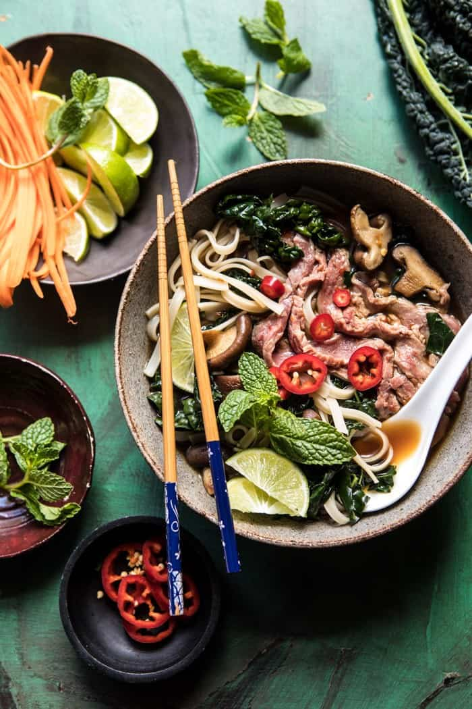

{width=100%}

**Prep Time:** 10 min | **Cook Time:** 40 min | **Total Time:** 50 min

## Ingredients

- 1 tablespoon extra virgin olive oil
- 4 ounces shiitake mushrooms, sliced
- 1  onion, quartered
- 4 cloves garlic, smashed
- 1 (2-3 inch) piece ginger, sliced in half
- 2  star anise
- 2  cinnamon sticks
- 5  whole cloves
- 8 cups beef bone broth ((or beef stock))
- 1 tablespoon fish sauce
- 1 tablespoon chili paste
- 1  bunch Tuscan kale, roughly torn
- kosher salt and pepper
- 4-8 ounces rice noodles
- 1/2 pound  sirloin steak or London broil, sliced thinly ((no more than 1/4 inch thick))
- bean sprouts, mint, basil, chile peppers, green onions, carrots, and limes, for serving

## Instructions

1. Heat the olive oil in a large soup pot over high heat. When the oil shimmers, add the mushrooms and a pinch of salt. Cook until the mushrooms are golden brown, about 4-5 minutes. Remove the mushrooms and set aside.
1. To the same pot, add the onion, garlic, and ginger and cook 3 minutes. Stir in the star anise, cinnamon, and cloves. Toast, stirring occasionally until the spices are fragrant, about 2-3 more minutes. Add the bone broth, fish sauce, and chili paste. Simmer for 15-20 minutes. Remove the onion, garlic, and spices from the broth, and discard.
1. Bring the broth to a boil. Add the kale and stir in the mushrooms. Season to taste with salt and pepper. Simmer 10 minutes or until ready to serve 3. Meanwhile, bring a large pot of water to a boil and cook the rice noodles according to package directions.
1. Divide the noodles between bowls and top with thinly sliced steak. Ladle the hot broth over the steak, submerging the steak and noodles in the hot broth. Top as desired with sprouts, chilies, herbs, limes, onions, and carrots. Enjoy!

