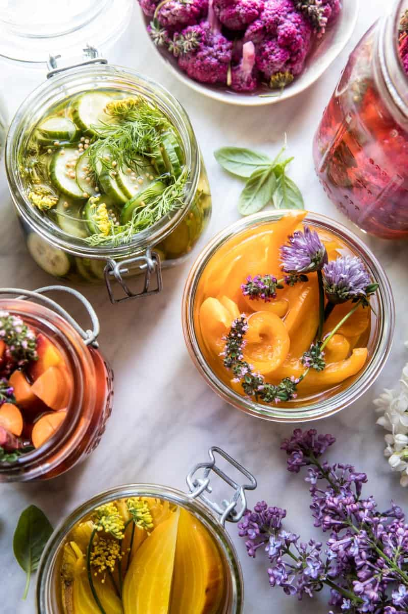

{width=100%}

**Prep Time:** 15 min | **Cook Time:** 5 min | **Total Time:** 20 min

## Ingredients

- fresh herbs, such as thyme, rosemary, basil, and dill
- 2-4 cloves garlic, smashed
- 1 teaspoon each black peppers and coriander seeds
- crush red pepper flakes or sliced chile peppers (optional)
- 2 pounds fresh fruits and veggies such as carrots, beets, cauliflower, asparagus, cherries, and strawberries
- 2 cups apple cider vinegar
- 2 cups water
- 1/4 cup kosher salt
- 2 tablespoons honey or sugar
- zest and juice of 1 lemon

## Instructions

1. If using, divide the herbs - garlic, peppercorns, coriander seeds, and chile flakes, among glass jars. Pack the fruits and veggies into the jars, packing them in tight, but leaving a 1/2 inch space at the top of the jar.
1. In a large pot, bring the vinegar, water, salt, and honey to a boil over high heat, stirring until the salt has dissolved. Remove from the heat and stir in the lemon zest and juice. Pour the pickling brine over the fruits and veggies, filling the jars up to 1/2 inch from the top. Seal the jars and let them cool at room temperature. Chill at least 4 hours and up to 2 months. The longer the fruits and veggies sit, the more flavor they will develop.

