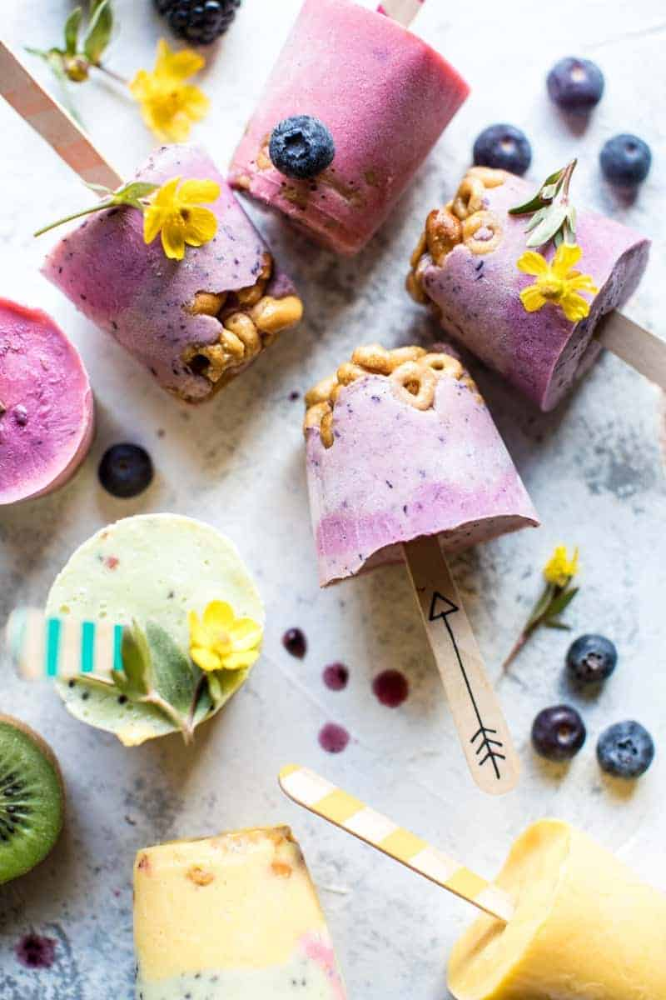

{width=100%}

**Prep Time:** 15 min | **Cook Time:** 15 min | **Total Time:** 30 min

## Ingredients

- 4 cups plain greek yogurt ((full fat works best))
- 1/4 cup honey
- 1 teaspoon vanilla extract
- 4 cups fresh or frozen fruit (strawberries, blackberries, blueberries, raspberries, bananas, pineapple, mangos, kiwi)
- 2 cups plain Cheerios
- 1 cup rolled oats
- 1/2 cup peanuts, roughly chopped
- 1/2 cup honey
- 3 tablespoons coconut oil or butter
- 2 teaspoons vanilla

## Instructions

1. In a blender, combine 1 cup of yogurt, 1 tablespoon honey, 1/4 teaspoon vanilla, and 1 cup of fruit, blend until smooth and creamy. Repeat this process with the remaining yogurt and fruit to create your desired rainbow colors.
1. To assemble, layer the granola (recipe follows) and yogurt evenly among 16 popsicles molds or paper dixie cups, creating layers with the colors of yogurt, if desired. Insert popsicles sticks and then cover the tops and freeze until firm, about 4 hours. To remove the popsicles run the mold under hot water for 10 seconds and then pull the popsicles out of the molds. Store in the freezer.

