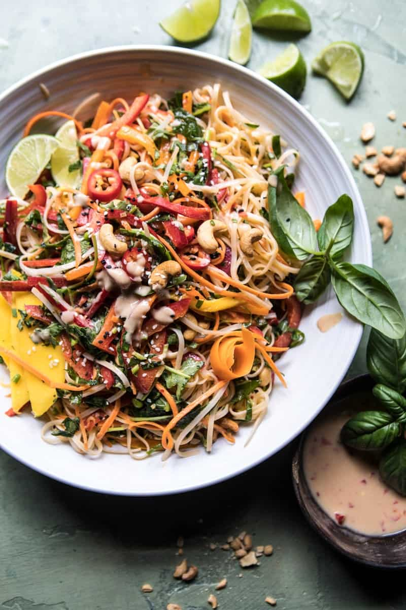

{width=100%}

**Prep Time:** 15 min | **Cook Time:** 5 min | **Total Time:** 20 min

## Ingredients

- 1/3 cup Simple Truth Tahini (sesame seed paste)
- 2 tablespoons honey
- juice and zest of 1 lime
- 2 tablespoons fish sauce
- 1 clove garlic, minced or grated
- 1 tablespoon fresh ginger, grated
- 1 (8 ounce box) rice noodles
- 4 cups baby kale, finely chopped
- 1 (16 ounce bag) frozen shelled edamame, thawed
- 3  carrots, shredded or chopped
- 2  bell peppers (red, yellow and or orange), sliced thin
- 1 cup fresh or frozen mango, chopped into chunks
- 2 stalks  lemongrass, finely chopped
- 4  green onions chopped
- 3/4 cup fresh basil, and cilantro
- sliced fresno peppers, sesame seeds and roasted cashews, for topping

## Instructions

1. To make the vinaigrette, combine the tahini, honey, lime juice, lime zest, fish sauce, garlic, and ginger in a small mason jar. Seal the jar and shake until the vinaigrette is combined.
1. Cook the rice noodle according to package directions. Drain and rinse under cold water. Add the noodles to a large salad bowl and toss together with the baby kale, edamame, carrots, bell peppers, lemongrass, green onions, herbs, and sesame seeds. Drizzle with the the vinaigrette and toss well to combine. Serve the salad warm or cold.

