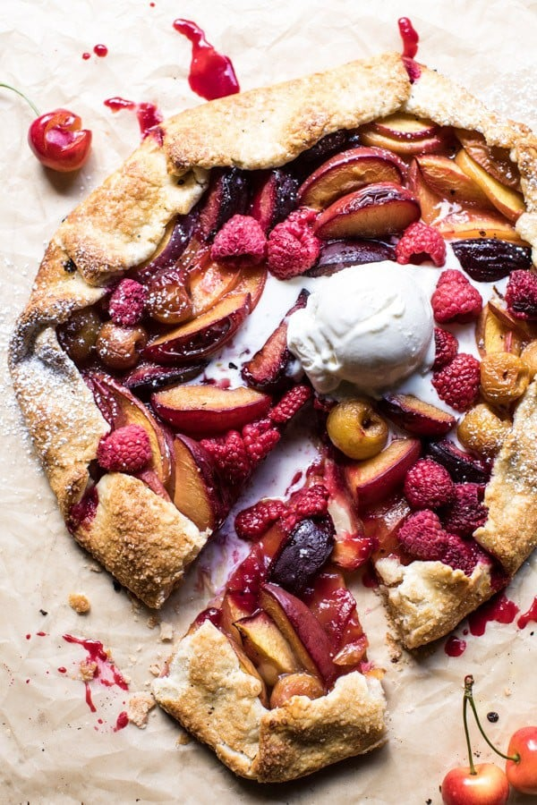

{width=100%}

**Prep Time:** 20 min | **Cook Time:** 40 min | **Total Time:** 1 hr

## Ingredients

- 1 1/2 cups flour
- 1/2 teaspoon kosher salt
- 8 tablespoons unsalted butter, cold + cut into 1/2 inch cubes
- 3-6 tablespoons cold buttermilk or water
- 3 cups sliced stone fruit
- 1/4 cup brown sugar
- 1 inch fresh knob fresh ginger, grated
- 1 tablespoon bourbon  ((optional))
- 1 tablespoon cornstarch
- juice from 1/2 a lemon
- 1 1/2 cups fresh raspberries
- 1  egg
- coarse sugar for sprinkling

## Instructions

1. Place the all-purpose flour, and salt in a large bowl. Add the butter and then use your fingers to break the butter into the flour until the mixture is the size of small peas. Add 3 tablespoons buttermilk and mix with a wooden spoon, drizzling in more as needed (no more than 1 tablespoon at a time), until dough just comes together (a few dry spots are ok). Gently knead dough on a lightly floured surface until no dry spots remain, about 1 minute. At this point you can cover the dough and place it in the fridge while you prepare the filling, or for up to one week.
1. In a bowl, toss together the stone fruit, brown sugar, ginger, bourbon (if using), cornstarch and lemon juice.
1. Now grab your dough from the fridge. Flour your work surface again and roll the dough to about 1/8-inch thick. Transfer to a baking sheet lined with parchment paper. Arrange the fruit over the dough in an even layer, leaving a 1 inch border around the dough. Pour any remaining juices left in the bowl over the fruit. Sprinkle the raspberries over top. Fold the edges of the dough over the filling. Brush the crust with the beaten egg and sprinkle the coarse sugar over the dough.
1. Place the galette in the fridge for 15 minutes or until ready to bake.
1. Preheat the oven to 400 degrees F. Bake the galette for 45-50 minutes or until the crust is golden and the fruit is soft and caramelized. Allow to cool slightly. Serve warm or at room temperature with a large scoop of ice cream.

