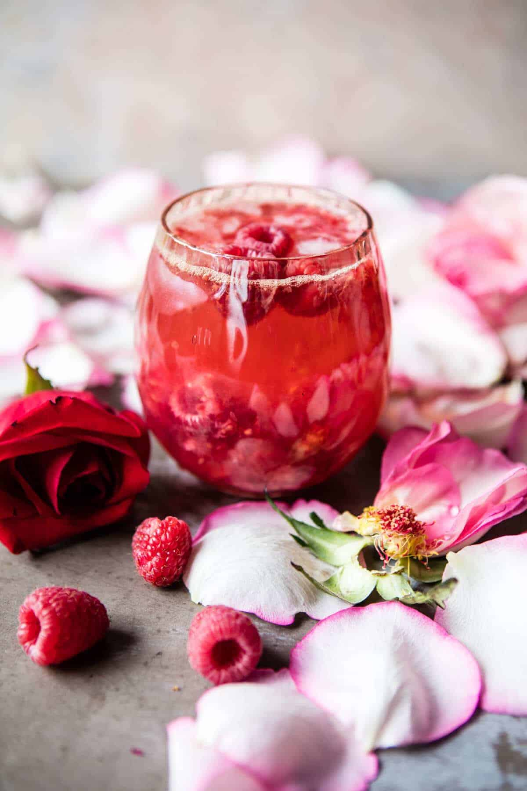

{width=100%}

**Prep Time:** 5 min | **Cook Time:**  | **Total Time:** 5 min

## Ingredients

- 4  fresh or frozen raspberries
- juice of 1/2 a lemon
- 2 ounces silver tequila
- 1-2 teaspoons rose water (optional)
- 1  plain or ginger kombucha

## Instructions

1. Muddle the raspberries, lemon juice, tequila, and rose water in a glass. Add ice, gently mix to combine. Pour the kombucha over top, again gently stirring to combine. DRINK! ?

