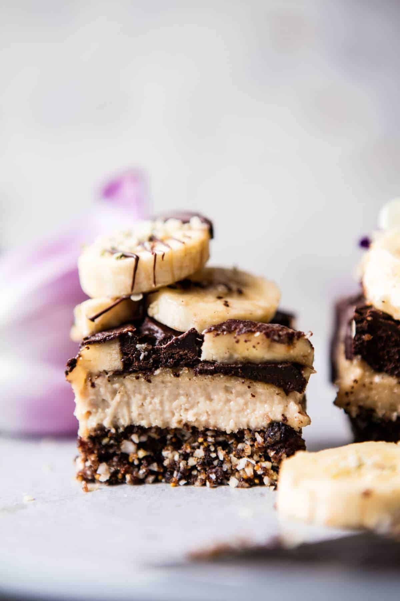

{width=100%}

**Prep Time:** 20 min | **Cook Time:**  | **Total Time:** 20 min

## Ingredients

- 1 cup raw pecans
- 2 cups raw unsweetened coconut
- 1 cup pitted packed dates
- 2 teaspoons vanilla extract
- pinch of flaky sea salt
- 2 cups roasted cashews
- 2-4  ripe, but firm bananas, sliced
- 1/2 cup coconut oil, melted
- 1 cup cocoa or cacao powder
- 1/3 cup honey, more or less to taste
- hemp or sesame seeds, for topping optional

## Instructions

1. Line an 8x8 inch square baking pan with parchment paper.
1. In the bowl of a food processor, combine the pecans, 1 cup coconut, dates, 1 teaspoon vanilla, and pinch of salt. Pulse until finely chopped and easily holds together when squeezed in your hand. Press the base mixture into the prepared pan. Place the pan in the freezer.
1. Going back to the bowl of your food processor (no need to clean it!), combine the cashews, remaining 1 cup coconut, 1/2 cup water, and remaining 1 teaspoon vanilla. Pulse until smooth and creamy. Remove the base layer from the freezer and add the cashew cream in an even layer. Top with sliced bananas.
1. In a separate bowl, whisk together the melted coconut oil, cocoa and honey. Pour the chocolate mixture over the bananas. Place in the fridge and chill until firm, at least 1 hour.
1. Cut into bars and serve topped with fresh bananas and seeds. Keep bars stored in the fridge.

