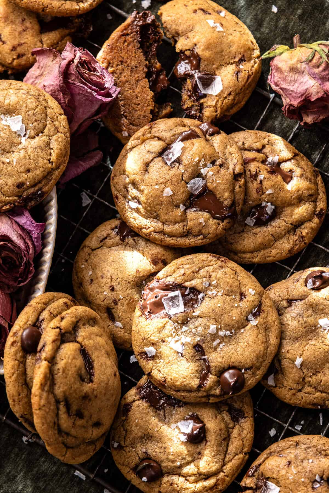

{width=100%}

**Prep Time:** 20 min | **Cook Time:** 10 min | **Total Time:** 40 min

## Ingredients

- 1 1/2 sticks salted butter, at room temperature
- 3/4 cup brown sugar
- 1/4 cup granulated sugar
- 1  large egg + 1 egg yolk, at room temperature
- 1 tablespoon vanilla extract
- 2 cups all-purpose flour
- 1 teaspoon baking soda
- 1/2 teaspoon salt
- 1 1/2 cups chopped chocolate chunks or chips
- flaky sea salt, for sprinkling

## Instructions

1. Preheat the oven to 350°F. Line a baking sheet with parchment paper.
1. Add the butter to a skillet set over medium heat. Cook, swirling, until the butter is lightly browned, 2-4 minutes. Pour into a bowl.
1. Whisk in the brown sugar, granulated sugar, egg, egg yolk, and vanilla until smooth. Add the flour, baking soda, and salt, mixing just until combined. Fold in the chocolate.
1. Roll the dough into rounded 1-tablespoon balls and arrange on the baking sheet. Freeze for 10 minutes. Bake 6 minutes, rotate the pan, then tap it on the counter 1–2 times to help flatten. Bake another 2–3 minutes, until the edges are set and the centers are just barely glossy.
1. Cool on the baking sheet. Sprinkle with flaky salt.

